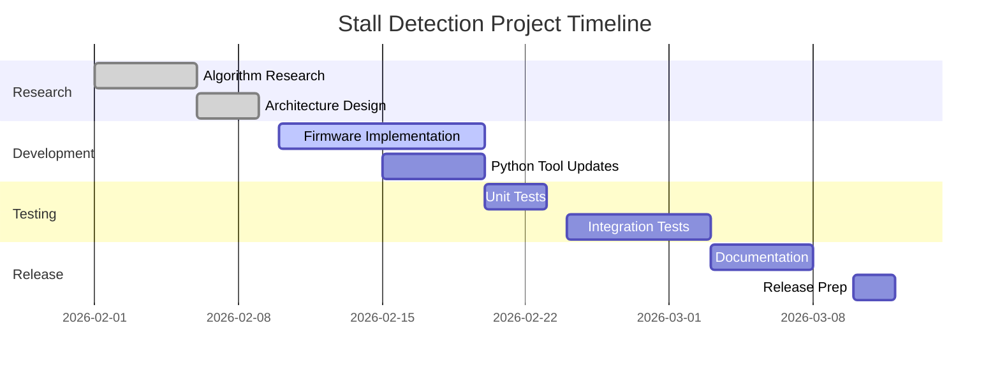

# ODrive Codebase Enhancement - Project Management Plan Template

> **Purpose:** This document provides a structured framework for Project Managers to plan, execute, and deliver enhancements to the ODrive motor controller codebase using GitHub Copilot.

---

## 📋 Executive Summary

### Project Vision
Systematically enhance the ODrive firmware and tooling ecosystem through feature additions, performance improvements, and safety hardening while maintaining backward compatibility and production stability.

### Success Criteria
- ✅ Zero regression in existing motor control functionality
- ✅ All new features covered by automated tests (>80% coverage)
- ✅ Documentation updated for all user-facing changes
- ✅ Performance benchmarks meet or exceed baseline
- ✅ Community feedback incorporated within 2 sprint cycles

---

## 🎯 Phase 1: Requirements Gathering & Analysis

### 1.1 Stakeholder Identification

| Stakeholder Group | Representatives | Primary Concerns | Engagement Method |
|-------------------|----------------|------------------|-------------------|
| **End Users** | Robotics builders, CNC operators | Reliability, ease of setup, documentation | GitHub Issues, Discord, surveys |
| **Firmware Engineers** | Core contributors | Code maintainability, performance | PR reviews, technical RFCs |
| **Application Developers** | Python/JS tool users | API stability, feature completeness | SDK feedback, example requests |
| **Hardware Team** | Board designers | Pin compatibility, electrical safety | Design review meetings |
| **QA/Test Engineers** | Test rig operators | Test coverage, regression detection | Test plan reviews |
| **Support Team** | Forum moderators | Common failure modes, diagnostics | Issue triage reports |

### 1.2 Requirements Collection Template

#### Feature Request Template
```markdown
## Feature Request: [Feature Name]

### Business Justification
- **Problem Statement:** What user pain point does this solve?
- **Impact Assessment:** How many users affected? (High/Medium/Low)
- **Competitive Analysis:** Do competing products have this?

### Technical Requirements
- **Functional Requirements:**
  1. User shall be able to...
  2. System shall provide...
  3. When X occurs, system shall...

- **Non-Functional Requirements:**
  - Performance: Must execute within X ms
  - Safety: Must not cause motor damage under Y condition
  - Compatibility: Must work with firmware versions Z and above

### Acceptance Criteria
- [ ] Criterion 1: Measurable outcome
- [ ] Criterion 2: Observable behavior
- [ ] Criterion 3: Performance threshold

### Dependencies
- **Firmware Files Affected:** `motor.cpp`, `controller.cpp`, etc.
- **Protocol Changes Required:** Yes/No
- **Breaking Changes:** Yes/No
- **Required Hardware:** v3.6-56V board, AS5047 encoder, etc.

### Risk Assessment
- **Technical Risk:** Low/Medium/High
- **Schedule Risk:** Low/Medium/High
- **Integration Risk:** Low/Medium/High
```

### 1.3 Requirements Prioritization Matrix

| Priority | Criteria | Example Features |
|----------|----------|------------------|
| **P0 - Critical** | Safety issues, production blockers | Overcurrent protection bug, USB disconnect crash |
| **P1 - High** | Major feature gaps, significant user pain | Stall detection, CAN FD support |
| **P2 - Medium** | Quality of life, performance improvements | Faster calibration, better error messages |
| **P3 - Low** | Nice-to-have, experimental | Advanced filtering algorithms, ML-based tuning |

### 1.4 Requirements Gathering Checklist

- [ ] Reviewed last 3 months of GitHub Issues (filter: `is:issue is:open label:enhancement`)
- [ ] Surveyed Discord community (create poll with top 5 requested features)
- [ ] Analyzed support ticket trends (most common failure modes)
- [ ] Conducted competitive analysis (Tinymovr, SimpleFOC, VESC)
- [ ] Reviewed performance profiling data from test rigs
- [ ] Interviewed 3-5 power users for deep-dive feedback
- [ ] Documented "won't fix" items with justification

---

## 🏗️ Phase 2: Project Planning & Design

### 2.1 Sample Enhancement Project: "Advanced Stall Detection System"

#### Project Charter

**Project Name:** Motor Stall Detection & Recovery Feature  
**Project Code:** ODR-STL-001  
**Sponsor:** Engineering Lead  
**Project Manager:** [Name]  
**Start Date:** 2026-02-01  
**Target Completion:** 2026-03-31  
**Budget:** 320 engineering hours  

**Objectives:**
1. Implement real-time stall detection algorithm
2. Add configurable recovery strategies
3. Reduce motor damage incidents by 80%
4. Maintain control loop timing (<1% jitter increase)

#### Work Breakdown Structure (WBS)

```
1.0 Project Initiation
    1.1 Kickoff meeting with stakeholders
    1.2 Requirements finalization
    1.3 Risk assessment workshop

2.0 Research & Design Phase
    2.1 Algorithm Research
        2.1.1 Literature review (back-EMF methods)
        2.1.2 Competitive product analysis
        2.1.3 Prototype in MATLAB/Python
    2.2 Architecture Design
        2.2.1 State machine design
        2.2.2 Interface definition in odrive-interface.yaml
        2.2.3 Safety review with hardware team

3.0 Implementation Phase
    3.1 Firmware Development
        3.1.1 Add StallDetector class to MotorControl/
        3.1.2 Integrate with Motor::update() loop
        3.1.3 Add configuration parameters
        3.1.4 Implement error flag handling
    3.2 Python Tool Updates
        3.2.1 Regenerate Python bindings
        3.2.2 Add stall_config helper in odrivetool
        3.2.3 Create stall test script
    3.3 Protocol Updates
        3.3.1 Add telemetry stream for stall metrics
        3.3.2 Update CAN message definitions

4.0 Testing & Validation
    4.1 Unit Testing
        4.1.1 Write doctest cases for StallDetector
        4.1.2 Mock test edge cases
    4.2 Integration Testing
        4.2.1 Test rig validation (10 load scenarios)
        4.2.2 Long-duration stress test (48hr)
    4.3 Performance Validation
        4.3.1 Benchmark loop timing impact
        4.3.2 Memory footprint analysis

5.0 Documentation & Release
    5.1 Technical Documentation
        5.1.1 Update docs/troubleshooting.rst
        5.1.2 Add stall detection section to docs/control.rst
        5.1.3 Generate Doxygen comments
    5.2 User Documentation
        5.2.1 Write configuration guide
        5.2.2 Create example Python scripts
        5.2.3 Record demo video
    5.3 Release Management
        5.3.1 Update CHANGELOG.md
        5.3.2 Create release notes
        5.3.3 Tag release version

6.0 Project Closure
    6.1 Post-mortem meeting
    6.2 Lessons learned documentation
    6.3 Archive project artifacts
```

#### Task Dependencies (Critical Path)



### 2.2 Resource Allocation

| Role | Allocation | Responsibilities |
|------|-----------|------------------|
| **Firmware Engineer** | 80 hours | Implement StallDetector class, integrate with control loop |
| **Python Developer** | 40 hours | Update odrivetool, create test scripts |
| **Test Engineer** | 60 hours | Develop test plan, execute validation tests |
| **Technical Writer** | 30 hours | Update docs, create user guides |
| **Hardware Engineer** | 20 hours (consulting) | Safety review, motor parameter guidance |
| **QA Lead** | 40 hours | Test coordination, regression testing |
| **DevOps Engineer** | 20 hours | CI/CD pipeline updates |
| **Project Manager** | 30 hours | Coordination, status reporting |

**Total:** 320 hours (~8 weeks with 2-person core team)

### 2.3 Risk Management Plan

| Risk ID | Risk Description | Probability | Impact | Mitigation Strategy | Owner |
|---------|-----------------|-------------|--------|---------------------|-------|
| R-001 | Algorithm false positives cause nuisance trips | High | High | Extensive tuning with test motors, configurable sensitivity | Firmware Engineer |
| R-002 | Performance overhead exceeds 1% budget | Medium | High | Early profiling, optimize hot path, consider compile-time flags | Firmware Engineer |
| R-003 | Breaking change to existing configurations | Low | Critical | Maintain backward compatibility, add feature flag | Tech Lead |
| R-004 | Test hardware unavailable | Medium | Medium | Order backup motors, use simulator for some tests | QA Lead |
| R-005 | Key team member unavailable | Medium | High | Cross-training, documentation of design decisions | PM |

### 2.4 Communication Plan

| Stakeholder | Frequency | Medium | Content |
|-------------|-----------|--------|---------|
| Core Team | Daily | Slack standup | Blockers, progress, next steps |
| Engineering Manager | Weekly | Video call | Status update, risks, resource needs |
| Community | Bi-weekly | GitHub Discussion | Feature preview, feedback request |
| All Stakeholders | Milestone completion | Email + Wiki | Milestone achievements, demo video |

---

## 🔨 Phase 3: Implementation with GitHub Copilot

### 3.1 GitHub Copilot Plan Integration

#### Step 1: Create Implementation Plan with Copilot

**Prompt for Copilot Chat:**
```
@workspace /plan Implement motor stall detection system

Context:
- Add StallDetector class to Firmware/MotorControl/
- Monitor relationship between motor.current_meas_ and encoder.vel_estimate_
- Trigger ERROR_STALL_DETECTED when velocity stops but current remains high
- Add config parameters: enable_stall_detection, stall_current_threshold, stall_time_threshold
- Maintain control loop timing (<1% overhead)
- Create Python test script in tools/odrive/tests/

Requirements:
1. Research phase: Analyze existing motor.cpp and encoder.cpp
2. Design phase: Create state machine diagram
3. Implementation phase: Add detection logic to Motor::update()
4. Testing phase: Create unit tests and integration tests
5. Documentation phase: Update troubleshooting docs

Please create a detailed multi-step plan with file analysis, code generation, and validation checkpoints.
```

#### Step 2: Execute Plan Incrementally

**For Each Plan Step:**
1. ✅ Review Copilot's analysis
2. ✅ Approve or refine the approach
3. ✅ Let Copilot generate code
4. ✅ Review generated code for:
   - Compliance with C++ coding standards (#file:.github/instructions/CPP_Coding_Practices.instructions.md)
   - Safety considerations (floating-point handling, ISR safety)
   - Performance impact (profiling annotations)
5. ✅ Run local tests before commit
6. ✅ Update plan status in project tracker

#### Step 3: Quality Gates

| Gate | Criteria | Responsible |
|------|----------|-------------|
| **Design Review** | Architecture approved by 2 senior engineers | Tech Lead |
| **Code Review** | PR approved, all CI checks pass | Firmware Engineer |
| **Test Coverage** | >80% line coverage, all edge cases covered | QA Lead |
| **Performance Validation** | <1% control loop timing increase | Performance Engineer |
| **Documentation Review** | User guide clear to non-expert | Technical Writer |
| **Security Review** | No new CVE patterns introduced | Security Team |

### 3.2 Development Workflow

#### Branch Strategy
```
main (protected)
  ├─ develop (integration branch)
  │   ├─ feature/stall-detection-core
  │   ├─ feature/stall-detection-python
  │   └─ feature/stall-detection-docs
  └─ hotfix/critical-bug-fix (if needed)
```

#### Commit Message Convention
```
feat(motor): add stall detection algorithm (#123)

- Implement back-EMF monitoring in Motor::update()
- Add StallDetectorConfig struct to odrive-interface.yaml
- Trigger ERROR_STALL_DETECTED on velocity stall condition

Performance: <1% overhead measured on test rig
Tests: Added 12 unit tests in test_motor.cpp
Docs: Updated docs/troubleshooting.rst

Closes #456
```

#### CI/CD Pipeline Stages
```yaml
stages:
  - lint: clang-format, cppcheck, flake8
  - build: Compile for all board variants
  - unit-test: Run doctest suite
  - integration-test: Deploy to test rig, run motor tests
  - performance-test: Compare against baseline benchmarks
  - docs-build: Generate Sphinx docs, check for warnings
  - release: Tag version, create GitHub release
```

---

## ✅ Phase 4: Testing & Validation

### 4.1 Test Strategy

#### Test Pyramid for ODrive

```
                    ▲
                   /|\
                  / | \
                 /  |  \
                / E2E \      10% - Full system tests on hardware
               /-------\
              /         \
             / Integration \  30% - Component interaction tests
            /-------------\
           /               \
          /   Unit Tests    \ 60% - Isolated function tests
         /-------------------\
```

#### Test Categories

| Test Type | Tools | Scope | Frequency |
|-----------|-------|-------|-----------|
| **Unit Tests** | doctest (C++), pytest (Python) | Individual functions, classes | Every commit |
| **Integration Tests** | Python test scripts + real hardware | Multi-component interactions | Every PR |
| **Regression Tests** | Automated test rig suite | Known failure scenarios | Nightly |
| **Performance Tests** | Custom profiling tools | Timing, memory, throughput | Weekly |
| **Hardware-in-Loop Tests** | Test rigs with motors | Full control loop validation | Pre-release |
| **Field Tests** | Beta user feedback | Real-world scenarios | Release candidates |

### 4.2 Test Plan Template

```markdown
## Test Plan: Stall Detection Feature

### Test Environment
- **Hardware:** ODrive v3.6-56V, BLDC motor (Turnigy Aerodrive SK3), AS5047 encoder
- **Power Supply:** 24V, 20A bench supply
- **Load:** Brake resistor for controlled stall conditions
- **Software:** Firmware v0.6.0-dev, Python tools v0.6.0-dev

### Test Cases

#### TC-001: Basic Stall Detection
**Objective:** Verify stall detection triggers when motor blocked  
**Preconditions:**
- Motor calibrated successfully
- `enable_stall_detection = True`
- `stall_current_threshold = 10.0` (A)
- `stall_time_threshold = 0.1` (seconds)

**Test Steps:**
1. Enter closed-loop velocity control
2. Set velocity setpoint to 10 rad/s
3. Manually block motor shaft
4. Wait for 0.2 seconds

**Expected Results:**
- `axis0.error` shows `ERROR_STALL_DETECTED`
- Motor current >= 10A during stall
- Axis transitions to IDLE state
- No motor damage or overheating

**Pass/Fail Criteria:** All expected results met

---

#### TC-002: False Positive Prevention
**Objective:** Verify no false stall detection during normal operation  
**Test Steps:**
1. Run motor for 30 minutes under varying loads
2. Log stall detector state every 100ms

**Expected Results:**
- Zero false stall detections
- No unexpected axis state changes

---

#### TC-003: Performance Impact
**Objective:** Measure control loop timing overhead  
**Test Steps:**
1. Baseline measurement: Measure loop timing with stall detection disabled
2. Overhead measurement: Measure loop timing with stall detection enabled
3. Compare results

**Pass Criteria:** Overhead < 1% of baseline timing

---

#### TC-004: Recovery Behavior
**Objective:** Verify motor can restart after stall cleared  
**Test Steps:**
1. Trigger stall condition
2. Clear stall (release motor shaft)
3. Call `axis0.clear_errors()`
4. Re-enter closed-loop control

**Expected Results:**
- Motor resumes normal operation
- No residual errors
```

### 4.3 Acceptance Testing Checklist

- [ ] All P0/P1 test cases pass (100%)
- [ ] All P2 test cases pass (>95%)
- [ ] No unresolved bugs with severity >= High
- [ ] Performance benchmarks meet targets
- [ ] Documentation reviewed and approved
- [ ] Beta testing feedback incorporated
- [ ] Backward compatibility verified (old config files still work)
- [ ] Migration guide provided for breaking changes

---

## 📊 Phase 5: Metrics & Monitoring

### 5.1 Key Performance Indicators (KPIs)

| KPI | Target | Measurement Method | Reporting Frequency |
|-----|--------|-------------------|---------------------|
| **Code Coverage** | >80% | gcov/lcov reports | Per PR |
| **Build Success Rate** | >95% | CI pipeline logs | Daily |
| **Mean Time to Resolution (Bugs)** | <7 days | GitHub Issues | Weekly |
| **Community Satisfaction** | >4.0/5.0 | Discord/forum polls | Monthly |
| **API Stability** | Zero breaking changes | Semantic versioning check | Per release |
| **Performance Regression** | <2% vs. baseline | Automated benchmarks | Weekly |

### 5.2 Sprint Metrics Dashboard

```
Sprint 3 Summary (2026-02-10 to 2026-02-23)
===========================================
✅ Story Points Completed: 28 / 30 (93%)
✅ Bugs Fixed: 8 / 10 (2 carried over)
⚠️  Test Coverage: 78% (target: 80%)
✅ Code Review Turnaround: 18 hours avg (target: <24h)
❌ Performance Test: 1.2% overhead (target: <1%) ← Needs optimization

Velocity Trend: ▆▇█ (improving)
```

### 5.3 Post-Release Monitoring

**Week 1-2 After Release:**
- Monitor GitHub Issues for new bug reports (label: `bug`, `regression`)
- Track error telemetry from opted-in users
- Review Discord #support channel for confusion/questions
- Analyze firmware update adoption rate

**Success Indicators:**
- <5 new bug reports related to feature
- <2 "how do I use this?" support requests
- >30% of active users update within 2 weeks

---

## 🎓 Phase 6: Knowledge Transfer & Closure

### 6.1 Documentation Deliverables

| Document | Audience | Location |
|----------|----------|----------|
| **User Guide** | End users | `docs/stall-detection.rst` |
| **API Reference** | Python developers | Auto-generated from docstrings |
| **Architecture Decision Records (ADRs)** | Future contributors | `docs/adr/0015-stall-detection-algorithm.md` |
| **Test Report** | QA team | `docs/test-reports/stall-detection-v1.pdf` |
| **Performance Analysis** | Performance team | `docs/performance/stall-detection-profiling.md` |
| **Migration Guide** | Existing users | `docs/migration/v0.5-to-v0.6.md` |

### 6.2 Post-Mortem Template

```markdown
## Project Post-Mortem: Stall Detection Feature

**Completed:** 2026-03-31  
**Attendees:** PM, Firmware Eng, QA Lead, Tech Writer

### What Went Well ✅
1. GitHub Copilot accelerated implementation by ~30%
2. Early prototype in Python helped validate algorithm
3. Strong collaboration between firmware and test teams

### What Could Be Improved ⚠️
1. Initial performance overhead exceeded target (required optimization sprint)
2. Test hardware availability caused 1-week delay
3. Documentation started too late (compressed schedule at end)

### Action Items for Next Project 📋
1. [ ] Reserve test hardware at project kickoff
2. [ ] Start documentation in parallel with development
3. [ ] Add performance profiling to CI pipeline earlier
4. [ ] Schedule design review before implementation starts

### Lessons Learned 🎓
- **Technical:** Back-EMF monitoring is sensitive to encoder noise; added low-pass filter
- **Process:** Daily standups kept team aligned despite distributed locations
- **Tools:** GitHub Copilot most effective when given detailed context via `#file:` references
```

### 6.3 Handoff Checklist

- [ ] Code merged to `main` branch
- [ ] Release notes published to GitHub
- [ ] All documentation updated and live on odriverobotics.com
- [ ] Knowledge base articles created for common questions
- [ ] Support team trained on new feature
- [ ] Community announcement posted (Discord, forum, mailing list)
- [ ] Project files archived in company wiki
- [ ] GitHub Project board closed
- [ ] Team celebration scheduled! 🎉

---

## 📦 Appendix: Templates & Tools

### A. GitHub Project Board Structure

**Columns:**
1. **Backlog** - Prioritized feature requests
2. **Ready for Dev** - Requirements finalized, dependencies resolved
3. **In Progress** - Actively being developed
4. **In Review** - PR submitted, awaiting approval
5. **In Testing** - Code merged to develop, QA in progress
6. **Done** - Released to production

### B. PR Template for ODrive

```markdown
## Description
Brief description of what this PR does.

## Related Issues
Closes #123
Relates to #456

## Type of Change
- [ ] Bug fix (non-breaking change which fixes an issue)
- [ ] New feature (non-breaking change which adds functionality)
- [ ] Breaking change (fix or feature that would cause existing functionality to not work as expected)
- [ ] Documentation update

## Testing Performed
- [ ] Unit tests added/updated
- [ ] Integration tests added/updated
- [ ] Tested on hardware (specify board version)
- [ ] Performance benchmarks run

## Checklist
- [ ] Code follows project coding standards (#file:.github/instructions/CPP_Coding_Practices.instructions.md)
- [ ] Self-review of code performed
- [ ] Comments added for complex logic
- [ ] Documentation updated (if applicable)
- [ ] No new compiler warnings introduced
- [ ] All CI checks pass

## Screenshots (if applicable)
<!-- Add oscilloscope captures, GUI screenshots, plots -->

## Performance Impact
<!-- Report timing measurements, memory usage changes -->
- Control loop overhead: +0.8%
- Flash usage: +2.4 KB
- RAM usage: +0.5 KB
```

### C. Weekly Status Report Template

```markdown
## Weekly Status Report - Week of [Date]

**Project:** Stall Detection Implementation  
**PM:** [Name]  
**Period:** 2026-02-10 to 2026-02-16

### Accomplishments ✅
- Completed algorithm research and design review
- Implemented StallDetector class (PR #789)
- 65% of unit tests written

### Upcoming (Next Week) 🎯
- Complete unit test suite
- Begin integration testing on test rig
- Start documentation draft

### Risks & Issues ⚠️
- **Risk:** Test motor delivery delayed 2 days (mitigated by using backup motor)
- **Issue:** Performance overhead at 1.2%, need to optimize (assigned to John)

### Metrics 📊
- Story points completed: 12/15
- Code coverage: 78%
- Open bugs: 3 (2 low, 1 medium)

### Help Needed 🙋
- Need hardware team consult on motor thermal limits (scheduled for Tue)
```

---

## 🚀 Getting Started: 3-Step Quick Start for PMs

### Step 1: Initiate Project (Week 1)
1. Copy this template to your project workspace
2. Fill in project charter section with stakeholder names
3. Create GitHub Project board using template structure
4. Schedule kickoff meeting with core team

### Step 2: Activate GitHub Copilot Plan (Week 1)
1. Open GitHub Copilot Chat in VS Code
2. Use the `/plan` command with detailed context:
   ```
   @workspace /plan [Your Feature Description]
   
   Include:
   - Requirements from Phase 1 document
   - Affected files from codebase analysis
   - Success criteria from acceptance tests
   - Constraints (performance, compatibility)
   ```
3. Review generated plan with technical lead
4. Break plan into GitHub Issues/Tasks

### Step 3: Execute & Monitor (Weeks 2-8)
1. Daily: Check CI/CD pipeline status
2. Weekly: Review metrics dashboard, publish status report
3. Bi-weekly: Sprint review with stakeholders
4. Per milestone: Update risk register, adjust schedule if needed

---

## 📞 Support & Resources

**Project Management Tools:**
- GitHub Projects (kanban boards, roadmaps)
- GitHub Copilot (AI-powered implementation assistant)
- Slack (daily team communication)
- Confluence/Wiki (documentation repository)

**Technical Resources:**
- ODrive Documentation: https://docs.odriverobotics.com
- GitHub Repository: https://github.com/madcowswe/ODrive
- Community Discord: https://discord.gg/odrive

**Contacts:**
- Engineering Lead: [Name] - technical decisions
- QA Lead: [Name] - test strategy
- Community Manager: [Name] - user feedback
- DevOps Lead: [Name] - CI/CD pipeline

---

**Document Version:** 1.0  
**Last Updated:** 2026-01-19  
**Next Review:** Quarterly (2026-04-01)  
**Owner:** Engineering Project Management Office
