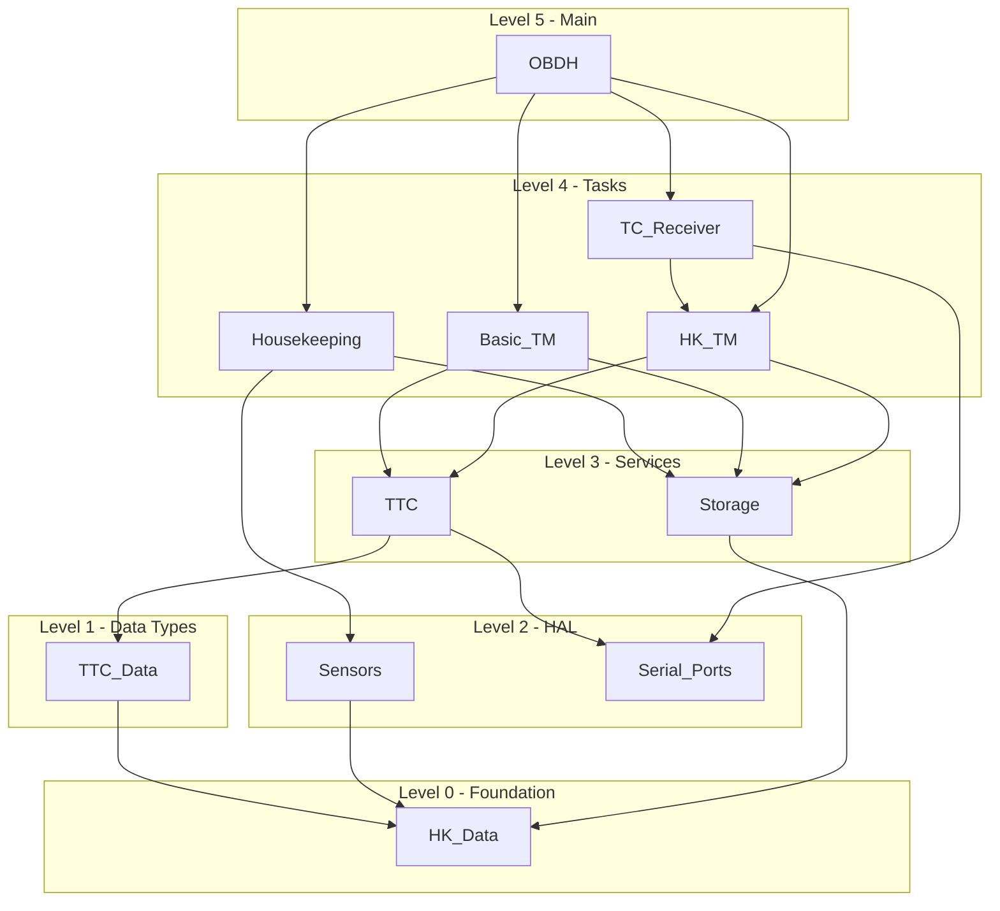

# Ada to C++ Migration Project Plan

**Created with GitHub Copilot Plan Mode**  
**Project Type:** Legacy Application Migration  
**Source:** Ada Embedded Systems (ToyOBDH - STR-UPM/Embedded_Ada_Examples)  
**Target:** Modern C++ (C++20/23)  
**Target Platform:** STM32 Microcontrollers

---

## Overview

This plan was generated using GitHub Copilot's **Plan Mode** workflow, which transforms project ideas into structured epics, features, and tasks. The plan follows best practices for migrating safety-critical Ada embedded systems to Modern C++ while preserving Ada's strong guarantees.

### Plan Mode Workflow Used

```
┌─────────────────┐     ┌─────────────────┐     ┌─────────────────┐
│     Legacy      │────▶│  GHCP reviews   │────▶│    Verifies     │
│   Application   │     │  and documents  │     │  documentation  │
│     (Ada)       │     │    codebase     │     │   complete      │
└─────────────────┘     └─────────────────┘     └────────┬────────┘
                                                         │
┌─────────────────┐     ┌─────────────────┐     ┌────────▼────────┐
│   Agent mode    │◀────│  GHCP in Plan   │◀────│   Works with    │
│    follows      │     │  Mode generates │     │   GHCP to       │
│ plan to implement│     │  plan for PRD   │     │ generate PRD    │
└─────────────────┘     └─────────────────┘     └─────────────────┘
```

---

## 📋 Epic: Migrate Ada Embedded System to Modern C++

**Epic Description:**  
Migrate the ToyOBDH (On-Board Data Handling) Ada embedded system to Modern C++ (C++20/23) while preserving type safety, concurrency guarantees, and real-time behavior. The migration follows a bottom-up dependency-driven approach.

**Acceptance Criteria:**
- [ ] All Ada packages migrated to C++ equivalents
- [ ] Type safety preserved via strong type wrappers
- [ ] Concurrency patterns correctly mapped (tasks, protected objects)
- [ ] Real-time timing behavior maintained
- [ ] All unit tests passing
- [ ] Zero dynamic allocation (embedded constraint)

---

## 🎯 Feature 1: Project Analysis & Planning

**Description:** Analyze the Ada project structure, identify dependencies, and create migration roadmap.

### Task 1.1: Scan Ada Source Files
**Assignee:** @ada-to-cpp-migrator  
**Labels:** `analysis`, `phase-0`

**Description:**
Scan all `.ads` (specifications) and `.adb` (bodies) files to build a complete inventory of the Ada project.

**Deliverables:**
- List of all packages with line counts
- Package dependency graph (with clauses)
- Identification of parent-child package relationships

**Command:**
```bash
@ada-to-cpp-migrator Analyze Ada project at C:\src\Embedded_Ada_Examples
```

---

### Task 1.2: Concurrency Inventory
**Assignee:** @ada-to-cpp-migrator  
**Labels:** `analysis`, `concurrency`

**Description:**
Identify and catalog all concurrent elements in the Ada codebase.

**Deliverables:**

| Component | Type | Package | Priority | Period | Notes |
|-----------|------|---------|----------|--------|-------|
| Housekeeping_Task | Cyclic | Housekeeping | 30 | 1000ms | Sensor reading |
| Basic_TM_Task | Cyclic | Basic_TM | Default | 10000ms | Telemetry |
| HK_TM_Task | Sporadic | HK_TM | Default | N/A | Triggered |
| TC_Receiver_Task | Sporadic | TC_Receiver | Default | N/A | Serial input |
| Buffer | Protected | Storage | N/A | N/A | Circular buffer |
| Request | Protected | HK_TM | N/A | N/A | Signal/Wait |

---

### Task 1.3: Type Catalog
**Assignee:** @ada-to-cpp-migrator  
**Labels:** `analysis`, `types`

**Description:**
Catalog all custom Ada types that require migration.

**Deliverables:**

| Ada Type | Category | Package | C++ Mapping |
|----------|----------|---------|-------------|
| `Sensor_Reading` | Derived | HK_Data | `StrongType<uint16_t>` |
| `Mission_Time` | Derived | HK_Data | `StrongType<uint64_t>` |
| `TM_Type` | Enum | TTC_Data | `enum class TmType` |
| `TC_Type` | Enum | TTC_Data | `enum class TcType` |
| `Sensor_Readings` | Record | HK_Data | `struct SensorReadings` |
| `Sensor_Data` | Record | HK_Data | `struct SensorData` |
| `TM_Message` | Record | TTC_Data | `struct TmMessage` |
| `HK_Log` | Array | HK_Data | `std::array<SensorData, 5>` |
| `Sensor` | Tagged | Sensors | `class Sensor` |

---

### Task 1.4: Generate Dependency Graph
**Assignee:** @ada-to-cpp-migrator  
**Labels:** `analysis`, `dependencies`

**Description:**
Create a visual dependency graph showing migration order.

**Deliverables:**


---

## 🎯 Feature 2: C++ Project Foundation

**Description:** Set up the C++ project structure with required infrastructure.

### Task 2.1: Create Project Structure
**Assignee:** @ada-to-cpp-migrator  
**Labels:** `setup`, `infrastructure`

**Description:**
Create the C++ project directory structure.

**Deliverables:**
```
embedded_cpp_obdh/
├── CMakeLists.txt              # Build configuration
├── include/
│   ├── embedded/               # Reusable foundation
│   │   ├── strong_type.hpp
│   │   ├── range_type.hpp
│   │   ├── protected_object.hpp
│   │   └── cyclic_task.hpp
│   ├── hal/                    # Hardware abstraction
│   │   ├── adc.hpp
│   │   ├── serial_port.hpp
│   │   └── gpio.hpp
│   └── obdh/                   # Application modules
│       ├── hk_data.hpp
│       ├── ttc_data.hpp
│       └── ...
├── src/
├── test/
└── main.cpp
```

---

### Task 2.2: Create Strong Type Library
**Assignee:** @ada-to-cpp-migrator  
**Labels:** `foundation`, `types`

**Description:**
Create the strong type wrapper library that preserves Ada's type safety.

**File:** `include/embedded/strong_type.hpp`

**Key Features:**
- Zero-overhead abstraction
- Prevents implicit conversions
- Supports arithmetic operations where applicable
- `constexpr` compatible

**Example:**
```cpp
template<typename T, typename Tag>
class StrongType {
    T value_;
public:
    constexpr explicit StrongType(T value) : value_(value) {}
    [[nodiscard]] constexpr T get() const { return value_; }
    // ... operators
};

// Usage
struct SensorReadingTag {};
using SensorReading = StrongType<std::uint16_t, SensorReadingTag>;
```

---

### Task 2.3: Create Cyclic Task Wrapper
**Assignee:** @ada-to-cpp-migrator  
**Labels:** `foundation`, `concurrency`

**Description:**
Create the cyclic task wrapper that maps Ada's `delay until` pattern.

**File:** `include/embedded/cyclic_task.hpp`

**Key Features:**
- Configurable period and priority
- RAII-based lifecycle
- Accurate timing with `sleep_until`
- Thread-safe start/stop

**Example:**
```cpp
struct TaskConfig {
    std::chrono::milliseconds period;
    int priority = 0;
    std::string_view name = "";
};

class CyclicTask {
    std::jthread thread_;
    TaskConfig config_;
    std::function<void()> work_;
public:
    CyclicTask(TaskConfig config, std::function<void()> work);
    void start();
    void stop();
};
```

---

## 🎯 Feature 3: Level 0 Migration (Foundation Types)

**Description:** Migrate packages with no dependencies first.

### Task 3.1: Migrate HK_Data Package
**Assignee:** @ada-to-cpp-migrator  
**Labels:** `migration`, `level-0`, `types`

**Prompt:**
```bash
@ada-to-cpp-migrator Migrate hk_data.ads to C++ strong types
```

**Source File:** `shared/ToyOBDH/src/hk_data.ads`

**Deliverables:**
- `include/obdh/hk_data.hpp`
- `test/test_hk_data.cpp`

**Ada to C++ Mapping:**
```ada
-- Ada
type Sensor_Reading is new UInt16;
type Mission_Time is new UInt64;
type Sensor_Data is record
   Readings  : Sensor_Readings;
   Timestamp : Mission_Time;
end record with Pack;
```

```cpp
// C++
struct SensorReadingTag {};
using SensorReading = embedded::StrongType<std::uint16_t, SensorReadingTag>;

struct MissionTimeTag {};
using MissionTime = embedded::StrongType<std::uint64_t, MissionTimeTag>;

struct alignas(1) SensorData {
    SensorReadings readings;
    MissionTime timestamp;
};
```

---

### Task 3.2: Migrate TTC_Data Package
**Assignee:** @ada-to-cpp-migrator  
**Labels:** `migration`, `level-0`, `types`

**Prompt:**
```bash
@ada-to-cpp-migrator Migrate ttc_data.ads to C++ types
```

**Source File:** `shared/ToyOBDH/src/ttc_data.ads`

**Deliverables:**
- `include/obdh/ttc_data.hpp`
- `test/test_ttc_data.cpp`

---

## 🎯 Feature 4: Level 2-3 Migration (HAL & Services)

**Description:** Migrate hardware abstraction and service layers.

### Task 4.1: Migrate Sensors Package
**Assignee:** @ada-to-cpp-migrator  
**Labels:** `migration`, `level-2`, `hal`

**Prompt:**
```bash
@ada-to-cpp-migrator Migrate sensors.ads to C++ sensor wrapper
```

**Deliverables:**
- `include/hal/adc.hpp`
- `include/obdh/sensors.hpp`
- `test/test_sensors.cpp`

---

### Task 4.2: Migrate Storage Protected Object
**Assignee:** @ada-to-cpp-migrator  
**Labels:** `migration`, `level-3`, `concurrency`

**Prompt:**
```bash
@ada-to-cpp-migrator Migrate Storage protected object from storage.ads
```

**Source File:** `shared/ToyOBDH/src/storage.ads`

**Pattern Mapping:**
```ada
-- Ada Protected Object
protected body Buffer is
   procedure Put (Data : in Sensor_Data) is ...
   function Empty return Boolean is ...
end Buffer;
```

```cpp
// C++ Mutex-wrapped Class
class Buffer {
    mutable std::mutex mutex_;
    std::array<SensorData, kCapacity> store_;
    std::size_t count_ = 0;
public:
    void put(const SensorData& data) {
        std::lock_guard lock{mutex_};
        // implementation
    }
    
    [[nodiscard]] bool empty() const {
        std::lock_guard lock{mutex_};
        return count_ == 0;
    }
};
```

**Deliverables:**
- `include/obdh/storage.hpp`
- `test/test_storage.cpp` (including thread safety tests)

---

## 🎯 Feature 5: Level 4 Migration (Tasks)

**Description:** Migrate Ada tasks to C++ task wrappers.

### Task 5.1: Migrate Housekeeping Task
**Assignee:** @ada-to-cpp-migrator  
**Labels:** `migration`, `level-4`, `concurrency`

**Prompt:**
```bash
@ada-to-cpp-migrator Migrate Housekeeping task with timing parameters
```

**Source File:** `shared/ToyOBDH/src/housekeeping.ads`

**Pattern Mapping:**
```ada
-- Ada Cyclic Task
task body Housekeeping_Task is
   Next_Time : Time := Clock + Milliseconds (Start_Delay);
begin
   loop
      delay until Next_Time;
      Read_Data;
      Next_Time := Next_Time + Milliseconds (Period);
   end loop;
end Housekeeping_Task;
```

```cpp
// C++ CyclicTask
embedded::CyclicTask housekeeping{
    {.period = 1000ms, .priority = 30, .name = "Housekeeping"},
    [] { read_data(); }
};
```

**Deliverables:**
- `include/obdh/housekeeping.hpp`
- `src/housekeeping.cpp`
- `test/test_housekeeping.cpp`

---

### Task 5.2: Migrate Basic_TM Task
**Assignee:** @ada-to-cpp-migrator  
**Labels:** `migration`, `level-4`, `concurrency`

**Prompt:**
```bash
@ada-to-cpp-migrator Migrate Basic_TM cyclic task
```

---

### Task 5.3: Migrate HK_TM Task with Protected Request
**Assignee:** @ada-to-cpp-migrator  
**Labels:** `migration`, `level-4`, `concurrency`

**Prompt:**
```bash
@ada-to-cpp-migrator Migrate HK_TM sporadic task with Request protected object
```

**Special Consideration:** This task uses a protected object with an entry barrier (Signal/Wait pattern).

**Pattern Mapping:**
```ada
-- Ada Entry with Barrier
protected body Request is
   entry Wait when Pending is
   begin
      Pending := False;
   end Wait;
   
   procedure Signal is
   begin
      Pending := True;
   end Signal;
end Request;
```

```cpp
// C++ Condition Variable
class Request {
    std::mutex mutex_;
    std::condition_variable cv_;
    bool pending_ = false;
public:
    void signal() {
        {
            std::lock_guard lock{mutex_};
            pending_ = true;
        }
        cv_.notify_one();
    }
    
    void wait() {
        std::unique_lock lock{mutex_};
        cv_.wait(lock, [this] { return pending_; });
        pending_ = false;
    }
};
```

---

### Task 5.4: Migrate TC_Receiver Task
**Assignee:** @ada-to-cpp-migrator  
**Labels:** `migration`, `level-4`, `concurrency`

**Prompt:**
```bash
@ada-to-cpp-migrator Migrate TC_Receiver task with serial port input
```

---

## 🎯 Feature 6: Main Entry Point & Integration

**Description:** Create the main entry point and wire all components.

### Task 6.1: Create main.cpp
**Assignee:** @ada-to-cpp-migrator  
**Labels:** `migration`, `level-5`, `integration`

**Prompt:**
```bash
@ada-to-cpp-migrator Create main.cpp that initializes and starts all tasks
```

**Pattern Mapping:**
```ada
-- Ada Main
procedure OBDH is
begin
   loop
      null;  -- Tasks run independently
   end loop;
end OBDH;
```

```cpp
// C++ Main
int main() {
    // Initialize hardware
    hal::init();
    
    // Start tasks (RAII - they auto-start)
    obdh::Housekeeping housekeeping;
    obdh::BasicTm basic_tm;
    obdh::HkTm hk_tm;
    obdh::TcReceiver tc_receiver;
    
    // Block forever (tasks run independently)
    while (true) {
        std::this_thread::sleep_for(1s);
    }
}
```

---

## 🎯 Feature 7: Verification & Testing

**Description:** Verify the migrated code meets all requirements.

### Task 7.1: Static Analysis
**Assignee:** @ada-to-cpp-migrator  
**Labels:** `verification`, `quality`

**Commands:**
```bash
# Compile with warnings
cmake --build . -- -Wall -Wextra -Werror -pedantic

# Run clang-tidy
clang-tidy include/**/*.hpp src/**/*.cpp

# Run cppcheck
cppcheck --enable=all include/ src/
```

---

### Task 7.2: Unit Tests
**Assignee:** @ada-to-cpp-migrator  
**Labels:** `verification`, `testing`

**Test Categories:**
- Type constraint tests (range violations)
- Thread safety tests (concurrent access)
- Timing accuracy tests (cyclic task periods)
- Serialization tests (stream I/O)

**Command:**
```bash
ctest --output-on-failure
```

---

### Task 7.3: Behavioral Equivalence
**Assignee:** @ada-to-cpp-migrator  
**Labels:** `verification`, `validation`

**Verification Checklist:**
- [ ] Same telemetry message structure
- [ ] Same timing behavior (within 1ms tolerance)
- [ ] Same serial protocol format
- [ ] Same error handling behavior

---

## 📊 Risk Assessment

| Risk | Impact | Probability | Mitigation |
|------|--------|-------------|------------|
| Stream I/O serialization | High | Medium | Custom binary serialization with struct packing |
| Real-time guarantees | High | Low | Use RTOS or Linux RT; verify timing |
| Protected object semantics | Medium | Medium | Careful condition variable usage |
| STM32 HAL differences | Medium | Medium | Abstract HAL layer; test early |
| Exception → error code | Medium | Low | Use `std::expected<T,E>` |

---

## 📅 Timeline

| Week | Milestone | Tasks |
|------|-----------|-------|
| 1 | Analysis Complete | 1.1, 1.2, 1.3, 1.4 |
| 1 | Foundation Ready | 2.1, 2.2, 2.3 |
| 2 | Level 0-1 Migrated | 3.1, 3.2 |
| 2 | Level 2-3 Migrated | 4.1, 4.2 |
| 3 | Level 4 Migrated | 5.1, 5.2, 5.3, 5.4 |
| 3 | Integration Complete | 6.1 |
| 4 | Verification Complete | 7.1, 7.2, 7.3 |

---

## 🔗 Related Resources

### Agents
- [ada-to-cpp-migrator.agent.md](../../src-ODrive/.github/agents/ada-to-cpp-migrator.agent.md)

### Skills
- [ada-cpp-migration/SKILL.md](../../src-ODrive/.github/skills/ada-cpp-migration/SKILL.md)

### Prompts
- [analyze-ada-project.prompt.md](../../src-ODrive/.github/prompts/analyze-ada-project.prompt.md)
- [migrate-ada-types.prompt.md](../../src-ODrive/.github/prompts/migrate-ada-types.prompt.md)
- [migrate-ada-protected.prompt.md](../../src-ODrive/.github/prompts/migrate-ada-protected.prompt.md)
- [migrate-ada-task.prompt.md](../../src-ODrive/.github/prompts/migrate-ada-task.prompt.md)

### Templates
- `strong_type.hpp` - Strong type wrapper
- `range_type.hpp` - Range-constrained types
- `protected_object.hpp` - Protected object base
- `cyclic_task.hpp` - Cyclic task wrapper

---

## ✅ Completion Checklist

- [ ] **Phase 0:** Project analyzed, dependency graph created
- [ ] **Phase 1:** C++ project structure created with foundation libraries
- [ ] **Phase 2:** Level 0 packages migrated (HK_Data, TTC_Data)
- [ ] **Phase 3:** Level 1-2 packages migrated (Sensors, Serial_Ports)
- [ ] **Phase 4:** Level 3 packages migrated (Storage, TTC)
- [ ] **Phase 5:** Level 4 tasks migrated (Housekeeping, Basic_TM, HK_TM, TC_Receiver)
- [ ] **Phase 6:** Main entry point created and integration tested
- [ ] **Phase 7:** All verification tests passing
- [ ] **Phase 8:** Documentation complete

---

**Plan Generated:** January 23, 2026  
**Plan Mode Version:** GitHub Copilot Plan Mode (Public Preview)  
**Agent Used:** @ada-to-cpp-migrator
