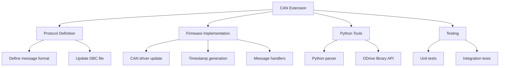

# Lesson 4: Agentic Development & Context Engineering

**Session Duration:** 45 minutes  
**Audience:** Embedded/C++ Developers (Intermediate to Advanced)  
**Environment:** Windows, VS Code  
**Extensions:** GitHub Copilot  
**Source Control:** GitHub/Bitbucket

---

## Overview

This lesson teaches you how to become an **agentic developer**—someone who orchestrates AI agents to accomplish complex development tasks efficiently. Instead of writing every line of code manually, you'll learn to direct specialized agents with rich context to produce production-quality embedded code.

**What You'll Learn:**
- The agentic mindset: from "how do I code this?" to "how do I describe this?"
- Context engineering: providing AI with the right information for accurate output
- Task decomposition: breaking complex features into agent-assignable subtasks
- Iterative refinement: polishing AI output into production-ready code

**Key Concepts:**
- **2 Orchestrator Agents:** `@ODrive-Engineer` (development) and `@ODrive-QA` (testing)
- **Skills:** Specialized capabilities agents invoke automatically (e.g., `odrive-qa-assistant`)
- **Context Layering:** Building prompts with constitution → agent → files → constraints → acceptance criteria

---

## Table of Contents

- [Overview](#overview)
- [Prerequisites](#prerequisites)
- [Why Agentic Development Matters](#why-agentic-development-matters)
- [Learning Path](#learning-path)
- [What is an Agentic Developer?](#1-what-is-an-agentic-developer-8-min)
- [Context Engineering Best Practices](#2-context-engineering-best-practices-12-min)
- [Decomposition Strategies](#3-decomposition-strategies-8-min)
- [Iterative Refinement Workflow](#4-iterative-refinement-workflow-5-min)
- [Guided Example: Agentic Refactoring](#5-guided-example-agentic-refactoring-12-min)
- [Practice Exercises](#practice-exercises)
- [Quick Reference](#quick-reference-agentic-patterns)
- [Troubleshooting](#troubleshooting)
- [Additional Resources](#additional-resources)
- [Frequently Asked Questions](#frequently-asked-questions)
- [Summary: Key Takeaways](#summary-key-takeaways)

---

## Prerequisites

Before starting this session, ensure you have:

- **Completed Planning & Steering Documents** - Understanding of custom instructions, prompt files, and custom agents
- **Visual Studio Code** with GitHub Copilot extensions installed and enabled
- **Active Copilot subscription** with access to all features
- **ODrive workspace** - Access to the ODrive firmware codebase
- **Custom agents configured** - Verify `.github/agents/` folder contains agent definitions

### Verify Your Setup

1. **Check custom agents are available:**
   - Open Chat view (Ctrl+Alt+I)
   - Click agents dropdown (should see @ODrive-Engineer, @ODrive-QA)
   - If missing, verify `src-ODrive/.github/agents/*.agent.md` files exist

2. **Test agent selection:**
   - Select `@ODrive-Engineer` from dropdown
   - Send a test message: "What's your specialty?"
   - Confirm specialized response mentioning firmware, motor control, or hardware

3. **Verify workspace context:**
   - Ensure `src-ODrive/Firmware/MotorControl/` folder is accessible
   - Check `src-ODrive/.github/copilot-instructions.md` exists
   - Verify skills folder: `src-ODrive/.github/skills/`

---

## Why Agentic Development Matters

The shift from traditional development to agentic development represents a fundamental change in how we approach complex coding tasks.

### Benefits of Agentic Development

1. **Accelerated Implementation**
   - Hours of manual coding reduced to minutes
   - Focus on design and requirements, not syntax
   - Parallel task execution with multiple agents

2. **Domain Expertise on Demand**
   - Specialized agents for firmware, motor control, testing
   - Consistent application of best practices
   - Encoded knowledge available to entire team

3. **Higher Quality Output**
   - Agents follow documented standards
   - Built-in validation and refinement loops
   - Cross-domain verification (firmware + QA)

4. **Reduced Cognitive Load**
   - Describe intent, not implementation
   - Agent handles boilerplate and patterns
   - Developer focuses on architecture decisions

---

## Learning Path

This lesson covers five key areas. Work through them sequentially or jump to specific topics as needed.

| Topic | What You'll Learn | Estimated Time |
|-------|-------------------|----------------|
| What is an Agentic Developer? | Mindset shift, agent orchestration | 8 min |
| Context Engineering Best Practices | 5 W's, layering strategy, techniques | 12 min |
| Decomposition Strategies | Top-down, bottom-up, horizontal slices | 8 min |
| Iterative Refinement Workflow | Generate, review, refine loop | 5 min |
| Guided Example | Motor diagnostics implementation | 12 min |

---

## 1. What is an Agentic Developer? (8 min)

### The Agentic Mindset
**🎯 Copilot Mode: Agent**

**Key Files:**
- [src-ODrive/.github/agents/ODrive-Engineer.agent.md](../../src-ODrive/.github/agents/ODrive-Engineer.agent.md) - Primary development orchestrator
- [src-ODrive/.github/agents/ODrive-QA.agent.md](../../src-ODrive/.github/agents/ODrive-QA.agent.md) - Testing & DevOps orchestrator
- [src-ODrive/.github/skills/](../../src-ODrive/.github/skills/) - Specialized skills invoked by agents

### Key Concepts

| Traditional Developer | Agentic Developer |
|----------------------|-------------------|
| Writes every line of code manually | Orchestrates AI agents to accomplish goals |
| Tools are passive (syntax highlighting) | Tools are active collaborators with expertise |
| Developer does all the thinking | Developer provides direction, AI implements |
| "How do I code this?" | "How do I describe this?" |
| Knowledge in your head | Knowledge in steering documents |

### Real-World Example: ODrive Motor Controller

**💬 Chat Mode Prompt (Traditional Approach):**
```
Developer thinks: "I need to add temperature monitoring to the motor"
→ Manually write thermistor reading code
→ Manually implement calibration
→ Manually add error handling
→ 2-4 hours of coding
```

**🤖 Agent Mode Prompt (Agentic Approach):**
```
@ODrive-Engineer Add temperature monitoring with NTC thermistor support

Context: #file:src-ODrive/Firmware/MotorControl/motor.hpp
         #file:src-ODrive/Firmware/MotorControl/thermistor.cpp

Requirements:
- Use Steinhart-Hart equation for temperature calculation
- Add thermal shutdown protection at 85°C
- Implement hysteresis to prevent oscillation
- Static allocation only, no exceptions

Acceptance Criteria:
- Compiles without warnings
- Temperature accurate within ±2°C
- Shutdown triggers reliably
```
Result: **15 minutes with review** (vs 2-4 hours manual)

> **Note:** The ODrive-Engineer agent will automatically invoke the appropriate **skill** (e.g., `odrive-qa-assistant` for building) based on your request.

### Custom Agents & Skills in ODrive

We have **2 orchestrator agents** that invoke **specialized skills**:

| Agent | Role | Invokes Skills |
|-------|------|----------------|
| `@ODrive-Engineer` | Primary development orchestrator | odrive-qa-assistant, devops-engineer, control-algorithms*, foc-tuning*, sensorless-control*, pcb-review*, signal-integrity* |
| `@ODrive-QA` | Testing & DevOps orchestrator | odrive-qa-assistant, test-automation*, devops-engineer |

*Skills marked with * are planned (🚧)

#### Available Skills (Production ✅)

| Skill | Capabilities |
|-------|-------------|
| `odrive-qa-assistant` | Build firmware, run tests, symbol search, interface inspection |
| `devops-engineer` | CI/CD workflows, releases, GitHub Actions, deployments |

#### Planned Skills (🚧)

| Skill | Capabilities |
|-------|-------------|
| `control-algorithms` | PID controllers, observers, control transformations |
| `foc-tuning` | Automated FOC parameter tuning, bandwidth measurement |
| `sensorless-control` | Sliding mode observers, PLL, back-EMF estimation |
| `pcb-review` | PCB schematic/layout review, design rule checking |
| `signal-integrity` | Impedance calculation, EMI analysis, crosstalk |

**Key Point:** Agents orchestrate skills. Ask `@ODrive-Engineer` for any development task—it routes to the right skill automatically!

---

## 2. Context Engineering Best Practices (12 min)

### Why Context Matters
**🎯 Copilot Modes: Chat + Agent**

**Files to demonstrate:**
- [src-ODrive/Firmware/MotorControl/motor.cpp](../../src-ODrive/Firmware/MotorControl/motor.cpp) - Motor implementation
- [src-ODrive/Firmware/MotorControl/axis.cpp](../../src-ODrive/Firmware/MotorControl/axis.cpp) - State machine patterns

AI models have **limited context windows**. The better you provide context, the better the output.

**💬 Chat Mode Prompt (Bad Context - Vague):**
```
"Fix the motor control bug"
```
Result: Generic suggestions, may not match ODrive architecture

**🤖 Agent Mode Prompt (Good Context - Specific):**
```
@ODrive-Engineer The current control loop in foc.cpp is causing 
oscillations at 50Hz when running at 3000 RPM.

Task Context: Control algorithm debugging

Context:
#file:src-ODrive/Firmware/MotorControl/foc.cpp
#file:src-ODrive/Firmware/MotorControl/axis.cpp

Details:
- PID controller gains: p_gain=0.5, i_gain=10, d_gain=0.001
- Looking at axis.cpp line 234, the current limiter might be interfering

Requirements:
- Maintain 8kHz control loop rate
- No heap allocation
- Preserve existing error handling

Can you analyze the oscillation source and suggest a fix?
```
Result: Targeted analysis with architecture-aware recommendations

### The 5 W's of Context Engineering

| Question | Purpose | Example |
|----------|---------|---------|
| **WHAT** | What are you trying to accomplish? | "Add overcurrent protection" |
| **WHERE** | Which files/modules are relevant? | "#file:motor.cpp, #file:foc.cpp" |
| **WHY** | What is the business/technical reason? | "Prevent motor damage from shorts" |
| **WHEN** | What are timing constraints or conditions? | "Must work in 8kHz ISR context" |
| **WHO** | Which agent has the right expertise? | "@ODrive-Engineer" or "@ODrive-QA" |

---

### Context Techniques
**🎯 Copilot Modes: Chat + Agent + Inline**

#### Technique 1: File References
**💬 Chat Mode Prompt:**
```
Review Firmware/MotorControl/motor.cpp and suggest optimizations for 
the current control loop. Focus on reducing CPU cycles in the hot path.
```

#### Technique 2: @-mentions
**🤖 Agent Mode Prompt:**
```
@workspace Find all uses of thermistor calibration
@ODrive-Engineer Refactor this into a reusable class following ODrive patterns
```

#### Technique 3: Code Selection + Inline Chat
- Select code in editor
- Press `Ctrl+I` (Windows) or `Cmd+I` (Mac)
- Context is automatically included
- Great for quick fixes and explanations

#### Technique 4: Multi-file Context
**🤖 Agent Mode Prompt:**
```
Looking at these files, refactor the state machine to use a cleaner design pattern:
#file:src-ODrive/Firmware/MotorControl/axis.hpp
#file:src-ODrive/Firmware/MotorControl/motor.cpp
#file:src-ODrive/Firmware/MotorControl/controller.cpp
```

#### Technique 5: Error Context
**💬 Chat Mode Prompt:**
```
@terminal shows this linker error: 
undefined reference to `Motor::apply_pwm_timings'

@ODrive-Engineer Fix the missing symbol. Check motor.hpp and motor.cpp for declaration/definition mismatch.
```

---

### Context Layering Strategy

| Layer | Source | Content |
|-------|--------|---------|
| **Layer 1** | `src-ODrive/.github/copilot-instructions.md` | Constitution - coding standards, safety rules (always loaded) |
| **Layer 2** | Agent Selection | Orchestrator expertise (`@ODrive-Engineer` for dev, `@ODrive-QA` for testing) |
| **Layer 3** | Specific Files | Exact files and line numbers referenced with `src-ODrive/` prefix |
| **Layer 4** | Requirements | Constraints like "static allocation only", "MISRA compliant" |
| **Layer 5** | Skills (Auto) | Agent automatically invokes appropriate skill based on task |

---

### Demonstration: Context Engineering with ODrive
**🎯 Copilot Mode: Agent**

**Scenario:** Add overcurrent protection to motor driver

**💬 Chat Mode Prompt (Poor Context):**
```
"Add overcurrent protection"
```
Result: Generic code, might not match ODrive architecture

**🤖 Agent Mode Prompt (Rich Context):**
```
@ODrive-Engineer Add overcurrent protection to the motor driver.

Context:
#file:src-ODrive/Firmware/MotorControl/motor.cpp
#file:src-ODrive/Firmware/MotorControl/foc.cpp
#file:src-ODrive/Firmware/MotorControl/axis.hpp

Details:
- Current sensing happens in foc.cpp via ADC DMA
- We have phase current measurements: Iu, Iv, Iw
- Motor has DC current limit: motor_.config_.current_lim
- Need to trigger ERROR_CURRENT_LIMIT_VIOLATION
- Must work in interrupt context (control loop at 8kHz)
- Use existing error handling framework from axis.hpp

Requirements:
- Check current magnitude on every PWM cycle
- Use fast sqrt approximation (arm_sqrt_f32)
- Add 10% hysteresis to prevent chattering
- No heap allocation
- MISRA C++ compliant

Acceptance Criteria:
- Compiles without warnings
- Current trip tested at 110% of limit
- Hysteresis prevents rapid on/off cycling
```

Result: Production-ready code that fits the architecture!

> The agent will invoke the `odrive-qa-assistant` skill to verify the build after implementation.

---

## 3. Decomposition Strategies (8 min)

### Why Decompose?
**🎯 Copilot Modes: Chat + Agent**

**Complex Task:**
```
"Implement sensorless motor control with observer-based position estimation"
```

**Problem:** Too broad for AI to handle in one shot

**Solution:** Break into subtasks using decomposition patterns

---

### Decomposition Patterns

#### Pattern 1: Top-Down (Architecture First)
**🤖 Agent Mode Prompts (Sequential):**

```
Step 1: "@ODrive-Engineer Design the API for sensorless estimator"
        → Define interfaces and data structures
        → Agent uses control-algorithms skill internally

Step 2: "@ODrive-Engineer Implement Luenberger observer"
        → Core algorithm implementation

Step 3: "@ODrive-Engineer Integrate estimator with axis.cpp"
        → Connect to existing control loop

Step 4: "@ODrive-QA Create integration tests and verify build"
        → Verification and validation via odrive-qa-assistant skill
```

#### Pattern 2: Bottom-Up (Build Components)
**🤖 Agent Mode Prompts (Sequential):**

```
Step 1: "Implement Clarke and Park transforms"
        → Utility functions first

Step 2: "Implement state prediction and correction"
        → Observer state update

Step 3: "Extract position/velocity from observer state"
        → Position estimator

Step 4: "Wire up estimator in motor control loop"
        → Full integration
```

#### Pattern 3: Horizontal Slice (End-to-End Feature)
**🤖 Agent Mode Prompts (Iterative):**

```
Step 1: "Simple open-loop position estimator (no feedback)"
        → Minimal viable implementation

Step 2: "Add back-EMF based correction"
        → Add feedback loop

Step 3: "Add startup sequence and fault detection"
        → Add robustness

Step 4: "Optimize for real-time performance"
        → Performance tuning
```

---

### Decomposition Example: ODrive CAN Protocol Extension
**🎯 Copilot Mode: Agent**

**Goal:** Add extended CAN message support with 64-bit timestamps

**Files to demonstrate:**
- [src-ODrive/Firmware/communication/can/](../../src-ODrive/Firmware/communication/) - CAN communication
- [src-ODrive/tools/create_can_dbc.py](../../src-ODrive/tools/create_can_dbc.py) - DBC file generator

**Decomposition Diagram:**



**🤖 Agent Mode Execution Plan:**
```
1. @ODrive-Engineer  - Define CAN message format (invokes pcb-review skill for electrical specs)
2. @ODrive-Engineer  - Implement CAN driver and handlers
3. Regular Copilot   - Update Python tools
4. @ODrive-QA        - Create comprehensive tests (invokes odrive-qa-assistant skill)
```

---

### When to Decompose

| Decompose If... | Don't Decompose If... |
|-----------------|----------------------|
| Task takes >30 minutes of manual work | Simple, isolated change |
| Multiple files/modules involved | Well-defined pattern to follow |
| Multiple domains (HW + FW + SW) | Single function or class |
| High complexity or uncertainty | Time to decompose > time to implement |
| You need to think through the design | Clear existing example to follow |

---

## 4. Iterative Refinement Workflow (5 min)

### The Refinement Loop
**🎯 Copilot Modes: Chat + Agent**

```
1. Generate → 2. Review → 3. Refine → 4. Regenerate
     ↑                                        ↓
     └────────────────────────────────────────┘
```

**Files to demonstrate:**
- [src-ODrive/Firmware/MotorControl/controller.cpp](../../src-ODrive/Firmware/MotorControl/controller.cpp) - PID implementation
- [src-ODrive/Firmware/MotorControl/encoder.cpp](../../src-ODrive/Firmware/MotorControl/encoder.cpp) - DMA callback patterns

---

### Example: Refining a Motor Control Function

**Iteration 1: Initial Generation**

**🤖 Agent Mode Prompt:**
```
@ODrive-Engineer Create a PID controller for velocity control
```
- **Result:** Basic PID with p, i, d gains
- **Review:** Missing anti-windup, no derivative filtering

**Iteration 2: Add Constraints**

**💬 Chat Mode Prompt:**
```
Add anti-windup and derivative filter with cutoff frequency
```
- **Result:** Better, but not handling sample time correctly
- **Review:** Sample time is hardcoded, should use axis.config_.control_period

**Iteration 3: Integrate with System**

**🤖 Agent Mode Prompt:**
```
Use axis.config_.control_period and match the coding style in:
#file:src-ODrive/Firmware/MotorControl/controller.cpp lines 45-89
```
- **Result:** Production-ready code that fits the architecture

---

### Refinement Strategies

#### Strategy 1: Be Specific About What's Wrong
**💬 Chat Mode Prompts:**

```
❌ Bad:  "This isn't quite right"

✅ Good: "The interrupt priority is too low. Should be 
         configLIBRARY_MAX_SYSCALL_INTERRUPT_PRIORITY per FreeRTOS rules"
```

#### Strategy 2: Reference Working Examples
**🤖 Agent Mode Prompt:**
```
Follow the same pattern used in encoder.cpp lines 123-145 
for the DMA callback handler:
#file:src-ODrive/Firmware/MotorControl/encoder.cpp
```

#### Strategy 3: Provide Constraints Incrementally
```
First pass:  Get basic functionality
Second pass: Add error handling
Third pass:  Optimize for performance
Fourth pass: Add documentation
```

#### Strategy 4: Use /fix for Errors
**💬 Chat Mode Prompt:**
```
/fix the linker error for undefined reference to foo()
```

---

### Review Checklist for Embedded Code

Before accepting generated code, verify:

- [ ] **Memory allocation** - Stack only? Size bounds checked?
- [ ] **Interrupt safety** - No blocking calls in ISR?
- [ ] **Thread safety** - Mutexes? Atomic operations?
- [ ] **Error handling** - All paths covered?
- [ ] **Coding style** - Matches project conventions?
- [ ] **Performance** - Tight loop optimizations?
- [ ] **Hardware constraints** - Timing requirements met?
- [ ] **Safety** - Watchdog, bounds checking?

---

## 5. Guided Example: Agentic Refactoring (12 min)

This guided example walks through a complete agentic workflow. Follow along to see all the techniques in action.

### Exercise: Add Enhanced Diagnostics to ODrive Motor
**🎯 Copilot Modes: Chat → Agent**

**Scenario:** You've been asked to add comprehensive motor diagnostics that track:
- Motor runtime hours
- Total revolutions
- Average power consumption
- Peak temperature reached
- Fault history (last 10 faults with timestamps)

**Files to work with:**
- [src-ODrive/Firmware/MotorControl/motor.hpp](../../src-ODrive/Firmware/MotorControl/motor.hpp) - Motor class definition
- [src-ODrive/Firmware/MotorControl/motor.cpp](../../src-ODrive/Firmware/MotorControl/motor.cpp) - Motor implementation
- [src-ODrive/Firmware/MotorControl/axis.hpp](../../src-ODrive/Firmware/MotorControl/axis.hpp) - Error handling patterns

---

### Step-by-Step Guide

#### Step 1: Context Preparation (2 min)

Open these files to understand the context:
```
Firmware/MotorControl/motor.hpp  - Motor class definition
Firmware/MotorControl/motor.cpp  - Motor implementation  
Firmware/MotorControl/axis.hpp   - Error handling
```

#### Step 2: Agent Selection & Initial Prompt (3 min)

**🤖 Agent Mode Prompt:**
```
@ODrive-Engineer I need to add comprehensive diagnostics to the Motor class.

Context:
#file:src-ODrive/Firmware/MotorControl/motor.hpp
#file:src-ODrive/Firmware/MotorControl/motor.cpp
#file:src-ODrive/Firmware/MotorControl/axis.hpp

Details:
- The Motor class already tracks basic state in motor_.current_control
- We have access to Iphase_a, Iphase_b, Iphase_c current measurements
- We have access to motor_.fet_thermistor for temperature
- Axis class handles errors via error_ member

Requirements:
- Add diagnostics struct to Motor class:
  - runtime_hours (float)
  - total_revolutions (uint64_t)
  - avg_power_watts (float)
  - peak_temperature_degC (float)
  - fault_history (circular buffer, last 10 faults)
- Update diagnostics in the motor control loop
- Diagnostics must be accessible via USB/CAN
- Use static memory allocation only
- Must work in interrupt context
- Follow ODrive coding standards

Acceptance Criteria:
- Compiles without warnings
- No dynamic allocation (verify with nm/objdump)
- Thread-safe access to diagnostics
- All fields documented with Doxygen

Start by showing me the struct definition for the diagnostics data.
```

> The ODrive-Engineer will orchestrate the implementation and can invoke `odrive-qa-assistant` to verify the build.

#### Step 3: Review & Refine (3 min)

**💬 Chat Mode Prompts (Follow-up):**
```
"How do we calculate runtime_hours? Should we use a timer or count control cycles?"

"For fault_history, show me the circular buffer implementation"

"Add a reset_diagnostics() method to clear all counters"
```

#### Step 4: Implementation Verification (2 min)

**🤖 Agent Mode Prompt (QA Validation):**
```
@ODrive-QA Review the motor diagnostics implementation.

Check for:
- Potential race conditions between ISR and main loop
- Interrupt safety (no blocking operations)
- Buffer overflow in fault_history
- Integer overflow in total_revolutions

Suggest unit tests for the diagnostics module.
```

> The QA agent will invoke `odrive-qa-assistant` skill to run builds and tests.

#### Step 5: Documentation (2 min)

**🤖 Agent Mode Prompt:**
```
@ODrive-Engineer Add comprehensive documentation comments to the 
diagnostics struct and methods following Doxygen style.

Include:
- @brief for each member
- @note for thread-safety considerations
- @warning for any limitations
- Usage example in class comment
```

---

### Success Criteria

By the end of this exercise, you should have:
- ✅ Complete struct definition with proper types
- ✅ Integration points identified in motor control loop
- ✅ Memory safety verified (no dynamic allocation)
- ✅ Interrupt safety confirmed
- ✅ Documentation generated
- ✅ Test approach defined

### Key Takeaways

1. **Start with context** - Reference relevant files and constraints
2. **Choose the right agent** - `@ODrive-Engineer` for development, `@ODrive-QA` for testing
3. **Be iterative** - Get the interface right first, then implementation
4. **Verify safety** - Always check interrupt and thread safety
5. **Cross-validate** - Use `@ODrive-QA` to review and run tests
6. **Agents invoke skills** - The orchestrator agents automatically route to specialized skills

---

## Practice Exercises

These exercises help you build agentic development skills. Try them on your own or with the ODrive codebase.

### Exercise 1: Agent Selection Practice

**Task:** For each scenario, identify the best agent and why:

| Scenario | Best Agent | Reason |
|----------|------------|--------|
| Add DMA-based ADC sampling | `@ODrive-Engineer` | Firmware/driver development |
| Tune velocity control loop gains | `@ODrive-Engineer` | Control algorithm work (add "control focus" to prompt) |
| Generate motor position unit tests | `@ODrive-QA` | Testing work (invokes `odrive-qa-assistant` skill) |
| Check CI pipeline status | `@ODrive-QA` | DevOps work (invokes `devops-engineer` skill) |
| Debug race condition in ISR | `@ODrive-Engineer` | Low-level firmware debugging |
| Review hardware interface timing | `@ODrive-Engineer` | Hardware focus (add constraints in prompt) |

**Key Insight:** The same agent (`@ODrive-Engineer`) handles different domains based on your prompt context. Add phrases like "hardware constraints", "control theory", or "firmware implementation" to guide the response.

---

### Exercise 2: Context Engineering Practice

**Task:** Transform this vague prompt into a rich context prompt.

**Vague Prompt:** "Make the encoder work better"

**Your Solution Template:**
```
@ODrive-Engineer [Specific problem with encoder]

Context:
#file:src-ODrive/Firmware/MotorControl/encoder.cpp
#file:src-ODrive/Firmware/MotorControl/encoder.hpp

Current Behavior:
- [What's happening now]
- [Symptoms observed]

Desired Behavior:
- [What should happen]
- [Performance targets]

Constraints:
- Static allocation only (no heap)
- Must work in 8kHz interrupt context
- Preserve backwards compatibility

Acceptance Criteria:
- [Measurable success criteria]
- Compiles without warnings
- [Test to verify fix]
```

**Example Rich Prompt:**
```
@ODrive-Engineer The encoder position has jitter of ±3 counts at standstill.

Context:
#file:src-ODrive/Firmware/MotorControl/encoder.cpp
#file:src-ODrive/Firmware/MotorControl/encoder.hpp

Current Behavior:
- Position oscillates ±3 counts when motor is stationary
- Jitter increases with higher CPR encoders
- Velocity estimate is noisy as a result

Desired Behavior:
- Stable position reading at standstill (±0 counts)
- Clean velocity estimate
- No impact on position accuracy during motion

Constraints:
- Static allocation only
- Must work in 8kHz interrupt context  
- Cannot add latency to position reading

Acceptance Criteria:
- Position stable at standstill (verify with scope)
- Velocity noise < 0.1 counts/ms at standstill
- Compiles without warnings
```

---

### Exercise 3: Task Decomposition Practice

**Task:** Decompose this complex feature into agent-assignable subtasks.

**Complex Task:** "Add support for absolute encoder (SSI protocol)"

**Decomposition Solution:**

| Step | Agent | Subtask | Output |
|------|-------|---------|--------|
| 1 | `@ODrive-Engineer` | Design SSI protocol interface and timing requirements | Interface spec, timing diagram |
| 2 | `@ODrive-Engineer` | Implement SPI-based SSI bit-banging driver | `ssi_encoder.cpp`, `ssi_encoder.hpp` |
| 3 | `@ODrive-Engineer` | Integrate SSI encoder with existing encoder abstraction | Updates to `encoder.cpp` |
| 4 | `@ODrive-QA` | Create test plan and hardware test rig config | Test cases, `test-rig-ssi.yaml` |

**Why This Decomposition Works:**
- Each step has a clear, focused output
- Steps build on each other sequentially
- Uses the same agent with different task contexts
- QA agent handles testing at the end

---

### Exercise 4: Motor Diagnostics Challenge

**Challenge:** Add comprehensive diagnostics to the Motor class.

**Requirements:**
- Track runtime hours (float)
- Track total revolutions (uint64_t)
- Track average power consumption (watts)
- Track peak temperature reached
- Maintain fault history (circular buffer, last 10 faults)

**Constraints:**
- Static memory allocation only
- Must work in 8kHz interrupt context
- Thread-safe access to diagnostics
- Accessible via USB/CAN protocols

**Step-by-Step Approach:**

**Step 1: Design the data structure**
```
@ODrive-Engineer Design a diagnostics struct for the Motor class.

Context:
#file:src-ODrive/Firmware/MotorControl/motor.hpp

Requirements:
- Track: runtime_hours, total_revolutions, avg_power_watts, peak_temp, fault_history
- Fault history: circular buffer, last 10 entries with timestamps
- Static allocation only
- Must be thread-safe for ISR access

Show me the struct definition with size calculation.
```

**Step 2: Implement tracking logic**
```
@ODrive-Engineer Implement runtime tracking in the motor control loop.

Context:
#file:src-ODrive/Firmware/MotorControl/motor.cpp

Details:
- Control loop runs at 8kHz
- Motor is "running" when current > 0.1A
- Count revolutions using encoder position delta

Where should this code go? Show implementation.
```

**Step 3: Verify with QA agent**
```
@ODrive-QA Review the motor diagnostics implementation for:
1. Race conditions between ISR and main loop
2. Integer overflow in counters
3. Memory safety in circular buffer

Suggest unit tests for the diagnostics module.
```

**Success Criteria:**
- ✅ Struct compiles without warnings
- ✅ No dynamic memory allocation
- ✅ Interrupt-safe implementation
- ✅ Circular buffer handles overflow correctly
- ✅ Test approach defined

---

## Quick Reference: Agentic Patterns

### Agent & Skill Selection Guide

| Task Type | Agent | Skill Invoked |
|-----------|-------|---------------|
| Low-level firmware | `@ODrive-Engineer` | (direct) + odrive-qa-assistant for builds |
| Control algorithms | `@ODrive-Engineer` | control-algorithms (🚧), foc-tuning (🚧) |
| Hardware interfaces | `@ODrive-Engineer` | pcb-review (🚧), signal-integrity (🚧) |
| Testing & validation | `@ODrive-QA` | odrive-qa-assistant, test-automation (🚧) |
| CI/CD & releases | `@ODrive-QA` | devops-engineer |

> **Legend:** 🚧 = Planned skill (not yet implemented)

### Context Engineering Checklist

| Element | Example |
|---------|---------|
| Agent selection | `@ODrive-Engineer` or `@ODrive-QA` |
| File references | `#file:src-ODrive/Firmware/MotorControl/motor.cpp` |
| Problem description | "Current oscillation at 50Hz" |
| Technical details | "PID gains: p=0.5, i=10, d=0.001" |
| Constraints | "Static allocation only, 8kHz ISR" |
| Acceptance criteria | "Compiles without warnings" |

### Decomposition Decision Tree

```
Is the task complex? (>30 min manual work)
├── YES → Decompose
│   ├── Development work? → @ODrive-Engineer (routes to skills)
│   ├── Testing/CI work? → @ODrive-QA (routes to qa/devops skills)
│   └── Multiple files? → Break by module, iterate
└── NO → Execute directly with appropriate agent
```

### Refinement Strategies

| Strategy | When to Use |
|----------|-------------|
| Be specific about errors | Code compiles but wrong behavior |
| Reference working examples | Need to match existing patterns |
| Add constraints incrementally | Basic version works, need hardening |
| Use /fix for compiler errors | Quick syntax/type fixes |

---

## Troubleshooting

| Issue | Solution |
|-------|----------|
| Agent not responding to domain questions | Verify agent file exists in `src-ODrive/.github/agents/` |
| Context seems ignored | Check file paths are correct, use #file: syntax with `src-ODrive/` prefix |
| Output doesn't match coding style | Add reference to existing code: "match style in motor.cpp lines 45-89" |
| Agent makes heap allocations | Add explicit constraint: "static allocation only, no new/malloc" |
| Generated code has race conditions | Add: "must be thread-safe, consider ISR context" |
| Too much output to review | Decompose into smaller subtasks |
| Agent suggests wrong patterns | Reference specific ODrive patterns to follow |
| Refinement loop not converging | Start over with more specific initial prompt |
| Skill not invoked | The agent decides when to invoke skills - be explicit about needing builds/tests |

### Debug Tips

1. **Agent selection issues:**
   - Check agents dropdown for available agents (`@ODrive-Engineer`, `@ODrive-QA`)
   - Verify `.agent.md` file format is correct
   - Look at agent source in `src-ODrive/.github/agents/`

2. **Context not being used:**
   - Ensure `#file:` paths include `src-ODrive/` prefix
   - Verify files exist at specified paths
   - Check for typos in file names

3. **Poor output quality:**
   - Add more Layer 4 constraints
   - Reference specific code examples
   - Break task into smaller pieces

4. **Skills not working:**
   - Check `src-ODrive/.github/skills/` for available skills
   - Some skills are planned (🚧) and not yet implemented

---

## Additional Resources

### Prompt Templates

Here are ready-to-use prompt templates for common embedded development tasks:

**Template 1: Add New Feature**
```
@ODrive-Engineer Add [feature name] to [module name].

Context:
#file:src-ODrive/Firmware/[path/to/file.cpp]
#file:src-ODrive/Firmware/[path/to/header.hpp]

Details:
- [Current state of the system]
- [Related components and their interfaces]
- [Any existing patterns to follow]

Requirements:
- [Constraint 1: e.g., static allocation only]
- [Constraint 2: e.g., must work in ISR context]
- [Constraint 3: e.g., MISRA compliant]

Acceptance Criteria:
- [Criterion 1: e.g., compiles without warnings]
- [Criterion 2: e.g., specific behavior verified]
```

**Template 2: Debug Issue**
```
@ODrive-Engineer Debug [symptom] in [module].

Context:
#file:src-ODrive/Firmware/[path/to/file.cpp]

Observed Behavior:
- [What's happening]
- [When it happens]
- [How to reproduce]

Expected Behavior:
- [What should happen]

Constraints:
- [Timing requirements]
- [Memory constraints]

Analyze the root cause and suggest a fix.
```

**Template 3: Generate Tests**
```
@ODrive-QA Create test plan for [feature/module].

Context:
#file:src-ODrive/Firmware/[path/to/implementation.cpp]

Feature Description:
- [What the feature does]
- [Key behaviors to verify]

Test Coverage Needed:
1. [Happy path scenarios]
2. [Error conditions]
3. [Edge cases]
4. [Performance requirements]

Provide test cases with acceptance criteria.
```

### Reference Files

- `src-ODrive/Firmware/MotorControl/motor.hpp` - Motor class structure
- `src-ODrive/Firmware/MotorControl/axis.hpp` - Error handling patterns
- `src-ODrive/.github/agents/ODrive-Engineer.agent.md` - Primary development agent
- `src-ODrive/.github/agents/ODrive-QA.agent.md` - Testing & DevOps agent
- `src-ODrive/.github/skills/` - Available skills directory
- `src-ODrive/.github/README.md` - Full agent system documentation

### Practice Scenarios

Try these scenarios to build your agentic development skills:

1. **Motor Diagnostics** - Add telemetry tracking (runtime hours, fault history)
2. **Safety Watchdog** - Implement fault detection for overcurrent, overtemp, encoder errors
3. **Configuration Manager** - Create validated config system with NVM persistence
4. **CAN Protocol Extension** - Add 64-bit timestamps to CAN messages

### Official Documentation

- [GitHub Copilot Custom Agents](https://code.visualstudio.com/docs/copilot/custom-agents)
- [Context Engineering Best Practices](https://docs.github.com/en/copilot/using-github-copilot/best-practices-for-using-github-copilot)

---

## Frequently Asked Questions

### When should I use @ODrive-Engineer vs @ODrive-QA?

| Use `@ODrive-Engineer` for: | Use `@ODrive-QA` for: |
|----------------------------|----------------------|
| Writing firmware code | Running builds and tests |
| Implementing control algorithms | Generating test plans |
| Debugging hardware interfaces | Reviewing code for issues |
| Designing data structures | CI/CD and deployment tasks |
| Refactoring existing code | Performance validation |

**Rule of thumb:** Development work → `@ODrive-Engineer`. Verification work → `@ODrive-QA`.

### How do I know if I've provided enough context?

Your prompt has enough context when it includes:
- ✅ Specific file references (`#file:src-ODrive/Firmware/...`)
- ✅ Clear problem statement (what, not how)
- ✅ Technical constraints (memory, timing, standards)
- ✅ Acceptance criteria (how to verify success)
- ✅ Examples of patterns to follow (if applicable)

**Signs of insufficient context:** Generic output, wrong patterns, doesn't compile, ignores constraints.

### What if the generated code doesn't compile?

1. **Use `/fix`** - Paste the error and ask Copilot to fix it
2. **Add more context** - Reference the file with the error
3. **Ask `@ODrive-QA`** - It can invoke build skills to diagnose
4. **Check constraints** - You may have conflicting requirements

### Can agents modify multiple files at once?

Yes! Agents in "Agent Mode" can:
- Edit multiple files in a single operation
- Create new files
- Run terminal commands
- Invoke skills for builds and tests

**Tip:** For large refactoring, decompose into smaller tasks and iterate.

### What's the difference between agents and skills?

| Agents | Skills |
|--------|--------|
| **Orchestrators** - Direct the conversation | **Capabilities** - Specific actions |
| You select them (`@ODrive-Engineer`) | Agents invoke them automatically |
| Defined in `.github/agents/` | Defined in `.github/skills/` |
| 2 in ODrive system | Multiple per agent |

**Example:** When you ask `@ODrive-QA` to run tests, it automatically invokes the `odrive-qa-assistant` skill.

### Which skills are implemented vs planned?

**Implemented (✅):**
- `odrive-qa-assistant` - Build firmware, run tests, symbol search
- `devops-engineer` - CI/CD workflows, releases, GitHub Actions

**Planned (🚧):**
- `control-algorithms` - PID, observers, control theory
- `foc-tuning` - FOC parameter tuning
- `sensorless-control` - Back-EMF estimation, PLL
- `pcb-review` - Schematic/layout review
- `signal-integrity` - EMI analysis, impedance

### How do I handle complex refactoring across many files?

1. **Decompose** - Break into file-by-file or module-by-module tasks
2. **Define interfaces first** - Get the API right before implementation
3. **Iterate** - Small changes, frequent verification
4. **Use Agent Mode** - It handles multi-file edits better than Chat
5. **Verify with `@ODrive-QA`** - Run builds after each major change

### Can I use this approach without custom agents?

Yes! The techniques work with regular Copilot too:
- Context engineering applies to all prompts
- Decomposition helps any complex task
- Iterative refinement improves any output

Custom agents add domain expertise and consistency, but aren't required.

---

## Summary: Key Takeaways

1. **You are the architect** - Direct agents, don't write every line
2. **Context is currency** - Better context = better output
3. **The 5 W's** - What, Where, Why, When, Who for every prompt
4. **Decompose complexity** - Break big tasks into agent-sized pieces
5. **Iterate to quality** - First output is rarely perfect
6. **Two agents, many skills** - `@ODrive-Engineer` (dev) + `@ODrive-QA` (test)
7. **Skills are automatic** - Agents invoke them based on your request
8. **Always verify** - Check safety, memory, interrupts for embedded code

---

*GitHub Copilot Agentic Development & Context Engineering Guide*  
*Last Updated: January 2026*
