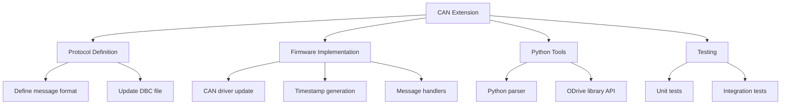

# Lesson 4: Agentic Development & Context Engineering

**Session Duration:** 45 minutes  
**Audience:** Embedded/C++ Developers (Intermediate to Advanced)  
**Environment:** Windows, VS Code  
**Extensions:** GitHub Copilot  
**Source Control:** GitHub/Bitbucket

---

## Table of Contents

- [Prerequisites](#prerequisites)
- [Why Agentic Development Matters](#why-agentic-development-matters)
- [Agenda](#agenda-agentic-development--context-engineering-45-min)
- [What is an Agentic Developer?](#1-what-is-an-agentic-developer-8-min)
- [Context Engineering Best Practices](#2-context-engineering-best-practices-12-min)
- [Decomposition Strategies](#3-decomposition-strategies-8-min)
- [Iterative Refinement Workflow](#4-iterative-refinement-workflow-5-min)
- [Hands-On: Agentic Refactoring](#5-hands-on-agentic-refactoring-12-min)
- [Speaker Instructions](#speaker-instructions)
- [Participant Instructions](#participant-instructions)
- [Quick Reference](#quick-reference-agentic-patterns)
- [Troubleshooting](#troubleshooting)
- [Additional Resources](#additional-resources)

---

## Prerequisites

Before starting this session, ensure you have:

- **Completed Planning & Steering Documents** - Understanding of custom instructions, prompt files, and custom agents
- **Visual Studio Code** with GitHub Copilot extensions installed and enabled
- **Active Copilot subscription** with access to all features
- **ODrive workspace** - Access to the ODrive firmware codebase
- **Custom agents configured** - Verify `.github/agents/` folder contains agent definitions

### Verify Your Setup

1. **Check custom agents are available:**
   - Open Chat view (Ctrl+Alt+I)
   - Click agents dropdown (should see @firmware-engineer, @motor-control-engineer, etc.)
   - If missing, verify `.github/agents/*.agent.md` files exist

2. **Test agent selection:**
   - Select `@firmware-engineer` from dropdown
   - Send a test message: "What's your specialty?"
   - Confirm specialized response

3. **Verify workspace context:**
   - Ensure `Firmware/MotorControl/` folder is accessible
   - Check `.github/copilot-instructions.md` exists

---

## Why Agentic Development Matters

The shift from traditional development to agentic development represents a fundamental change in how we approach complex coding tasks.

### Benefits of Agentic Development

1. **Accelerated Implementation**
   - Hours of manual coding reduced to minutes
   - Focus on design and requirements, not syntax
   - Parallel task execution with multiple agents

2. **Domain Expertise on Demand**
   - Specialized agents for firmware, motor control, testing
   - Consistent application of best practices
   - Encoded knowledge available to entire team

3. **Higher Quality Output**
   - Agents follow documented standards
   - Built-in validation and refinement loops
   - Cross-domain verification (firmware + QA)

4. **Reduced Cognitive Load**
   - Describe intent, not implementation
   - Agent handles boilerplate and patterns
   - Developer focuses on architecture decisions

---

## Agenda: Agentic Development & Context Engineering (45 min)

| Sub-Topic | Focus | Time |
|-----------|-------|------|
| What is an Agentic Developer? | Mindset shift, agent orchestration | 8 min |
| Context Engineering Best Practices | 5 W's, layering strategy, techniques | 12 min |
| Decomposition Strategies | Top-down, bottom-up, horizontal slices | 8 min |
| Iterative Refinement Workflow | Generate, review, refine loop | 5 min |
| **Hands-On:** Agentic Refactoring | Motor diagnostics implementation | 12 min |

---

## 1. What is an Agentic Developer? (8 min)

### The Agentic Mindset
**🎯 Copilot Modes: Agent**

**Files to demonstrate:**
- [.github/agents/firmware-engineer.agent.md](../../.github/agents/firmware-engineer.agent.md) - Firmware specialist agent
- [.github/agents/motor-control-engineer.agent.md](../../.github/agents/motor-control-engineer.agent.md) - Control theory agent

### Key Concepts

| Traditional Developer | Agentic Developer |
|----------------------|-------------------|
| Writes every line of code manually | Orchestrates AI agents to accomplish goals |
| Tools are passive (syntax highlighting) | Tools are active collaborators with expertise |
| Developer does all the thinking | Developer provides direction, AI implements |
| "How do I code this?" | "How do I describe this?" |
| Knowledge in your head | Knowledge in steering documents |

### Real-World Example: ODrive Motor Controller

**💬 Chat Mode Prompt (Traditional Approach):**
```
Developer thinks: "I need to add temperature monitoring to the motor"
→ Manually write thermistor reading code
→ Manually implement calibration
→ Manually add error handling
→ 2-4 hours of coding
```

**🤖 Agent Mode Prompt (Agentic Approach):**
```
@firmware-engineer Add temperature monitoring with NTC thermistor support

Context: #file:src-ODrive/Firmware/MotorControl/motor.hpp
         #file:src-ODrive/Firmware/MotorControl/thermistor.cpp

Requirements:
- Use Steinhart-Hart equation for temperature calculation
- Add thermal shutdown protection at 85°C
- Implement hysteresis to prevent oscillation
- Static allocation only, no exceptions

Acceptance Criteria:
- Compiles without warnings
- Temperature accurate within ±2°C
- Shutdown triggers reliably
```
Result: **15 minutes with review** (vs 2-4 hours manual)

### Custom Agents in ODrive

We have 4 specialized agents available:

| Agent | Specialty | Use When |
|-------|-----------|----------|
| `@firmware-engineer` | STM32, interrupts, DMA, FreeRTOS | Low-level firmware tasks |
| `@hardware-engineer` | PCB design, pinouts, electrical specs | Hardware interface questions |
| `@motor-control-engineer` | FOC algorithms, PID tuning, control theory | Control loop design |
| `@qa-engineer` | Test generation, bug verification | Testing and validation |

**Key Point:** Each agent has domain expertise encoded in their instructions. Use them!

---

## 2. Context Engineering Best Practices (12 min)

### Why Context Matters
**🎯 Copilot Modes: Chat + Agent**

**Files to demonstrate:**
- [src-ODrive/Firmware/MotorControl/motor.cpp](../../src-ODrive/Firmware/MotorControl/motor.cpp) - Motor implementation
- [src-ODrive/Firmware/MotorControl/axis.cpp](../../src-ODrive/Firmware/MotorControl/axis.cpp) - State machine patterns

AI models have **limited context windows**. The better you provide context, the better the output.

**💬 Chat Mode Prompt (Bad Context - Vague):**
```
"Fix the motor control bug"
```
Result: Generic suggestions, may not match ODrive architecture

**🤖 Agent Mode Prompt (Good Context - Specific):**
```
@motor-control-engineer The current control loop in foc.cpp is causing 
oscillations at 50Hz when running at 3000 RPM.

Context:
#file:src-ODrive/Firmware/MotorControl/foc.cpp
#file:src-ODrive/Firmware/MotorControl/axis.cpp

Details:
- PID controller gains: p_gain=0.5, i_gain=10, d_gain=0.001
- Looking at axis.cpp line 234, the current limiter might be interfering

Requirements:
- Maintain 8kHz control loop rate
- No heap allocation
- Preserve existing error handling

Can you analyze the oscillation source and suggest a fix?
```
Result: Targeted analysis with architecture-aware recommendations

### The 5 W's of Context Engineering

| Question | Purpose | Example |
|----------|---------|---------|
| **WHAT** | What are you trying to accomplish? | "Add overcurrent protection" |
| **WHERE** | Which files/modules are relevant? | "#file:motor.cpp, #file:foc.cpp" |
| **WHY** | What is the business/technical reason? | "Prevent motor damage from shorts" |
| **WHEN** | What are timing constraints or conditions? | "Must work in 8kHz ISR context" |
| **WHO** | Which agent has the right expertise? | "@firmware-engineer" |

---

### Context Techniques
**🎯 Copilot Modes: Chat + Agent + Inline**

#### Technique 1: File References
**💬 Chat Mode Prompt:**
```
Review Firmware/MotorControl/motor.cpp and suggest optimizations for 
the current control loop. Focus on reducing CPU cycles in the hot path.
```

#### Technique 2: @-mentions
**🤖 Agent Mode Prompt:**
```
@workspace Find all uses of thermistor calibration
@firmware-engineer Refactor this into a reusable class following ODrive patterns
```

#### Technique 3: Code Selection + Inline Chat
- Select code in editor
- Press `Ctrl+I` (Windows) or `Cmd+I` (Mac)
- Context is automatically included
- Great for quick fixes and explanations

#### Technique 4: Multi-file Context
**🤖 Agent Mode Prompt:**
```
Looking at these files, refactor the state machine to use a cleaner design pattern:
#file:src-ODrive/Firmware/MotorControl/axis.hpp
#file:src-ODrive/Firmware/MotorControl/motor.cpp
#file:src-ODrive/Firmware/MotorControl/controller.cpp
```

#### Technique 5: Error Context
**💬 Chat Mode Prompt:**
```
@terminal shows this linker error: 
undefined reference to `Motor::apply_pwm_timings'

@firmware-engineer Fix the missing symbol. Check motor.hpp and motor.cpp for declaration/definition mismatch.
```

---

### Context Layering Strategy

| Layer | Source | Content |
|-------|--------|---------|
| **Layer 1** | `.github/copilot-instructions.md` | Coding standards, naming conventions (always loaded) |
| **Layer 2** | Agent Selection | Domain expertise (`@firmware-engineer` for embedded) |
| **Layer 3** | Specific Files | Exact files and line numbers referenced |
| **Layer 4** | Requirements | Constraints like "static allocation only", "MISRA compliant" |

---

### Demonstration: Context Engineering with ODrive
**🎯 Copilot Mode: Agent**

**Scenario:** Add overcurrent protection to motor driver

**💬 Chat Mode Prompt (Poor Context):**
```
"Add overcurrent protection"
```
Result: Generic code, might not match ODrive architecture

**🤖 Agent Mode Prompt (Rich Context):**
```
@firmware-engineer Add overcurrent protection to the motor driver.

Context:
#file:src-ODrive/Firmware/MotorControl/motor.cpp
#file:src-ODrive/Firmware/MotorControl/foc.cpp
#file:src-ODrive/Firmware/MotorControl/axis.hpp

Details:
- Current sensing happens in foc.cpp via ADC DMA
- We have phase current measurements: Iu, Iv, Iw
- Motor has DC current limit: motor_.config_.current_lim
- Need to trigger ERROR_CURRENT_LIMIT_VIOLATION
- Must work in interrupt context (control loop at 8kHz)
- Use existing error handling framework from axis.hpp

Requirements:
- Check current magnitude on every PWM cycle
- Use fast sqrt approximation (arm_sqrt_f32)
- Add 10% hysteresis to prevent chattering
- No heap allocation
- MISRA C++ compliant

Acceptance Criteria:
- Compiles without warnings
- Current trip tested at 110% of limit
- Hysteresis prevents rapid on/off cycling
```

Result: Production-ready code that fits the architecture!

---

## 3. Decomposition Strategies (8 min)

### Why Decompose?
**🎯 Copilot Modes: Chat + Agent**

**Complex Task:**
```
"Implement sensorless motor control with observer-based position estimation"
```

**Problem:** Too broad for AI to handle in one shot

**Solution:** Break into subtasks using decomposition patterns

---

### Decomposition Patterns

#### Pattern 1: Top-Down (Architecture First)
**🤖 Agent Mode Prompts (Sequential):**

```
Step 1: "@motor-control-engineer Design the API for sensorless estimator"
        → Define interfaces and data structures

Step 2: "@motor-control-engineer Implement Luenberger observer"
        → Core algorithm implementation

Step 3: "@firmware-engineer Integrate estimator with axis.cpp"
        → Connect to existing control loop

Step 4: "@qa-engineer Create integration tests"
        → Verification and validation
```

#### Pattern 2: Bottom-Up (Build Components)
**🤖 Agent Mode Prompts (Sequential):**

```
Step 1: "Implement Clarke and Park transforms"
        → Utility functions first

Step 2: "Implement state prediction and correction"
        → Observer state update

Step 3: "Extract position/velocity from observer state"
        → Position estimator

Step 4: "Wire up estimator in motor control loop"
        → Full integration
```

#### Pattern 3: Horizontal Slice (End-to-End Feature)
**🤖 Agent Mode Prompts (Iterative):**

```
Step 1: "Simple open-loop position estimator (no feedback)"
        → Minimal viable implementation

Step 2: "Add back-EMF based correction"
        → Add feedback loop

Step 3: "Add startup sequence and fault detection"
        → Add robustness

Step 4: "Optimize for real-time performance"
        → Performance tuning
```

---

### Decomposition Example: ODrive CAN Protocol Extension
**🎯 Copilot Mode: Agent**

**Goal:** Add extended CAN message support with 64-bit timestamps

**Files to demonstrate:**
- [src-ODrive/Firmware/communication/can/](../../src-ODrive/Firmware/communication/) - CAN communication
- [src-ODrive/tools/create_can_dbc.py](../../src-ODrive/tools/create_can_dbc.py) - DBC file generator

**Decomposition Diagram:**



**🤖 Agent Mode Execution Plan:**
```
1. @hardware-engineer - Define CAN message format and electrical specs
2. @firmware-engineer - Implement CAN driver and handlers
3. Regular Copilot    - Update Python tools
4. @qa-engineer       - Create comprehensive tests
```

---

### When to Decompose

| Decompose If... | Don't Decompose If... |
|-----------------|----------------------|
| Task takes >30 minutes of manual work | Simple, isolated change |
| Multiple files/modules involved | Well-defined pattern to follow |
| Multiple domains (HW + FW + SW) | Single function or class |
| High complexity or uncertainty | Time to decompose > time to implement |
| You need to think through the design | Clear existing example to follow |

---

## 4. Iterative Refinement Workflow (5 min)

### The Refinement Loop
**🎯 Copilot Modes: Chat + Agent**

```
1. Generate → 2. Review → 3. Refine → 4. Regenerate
     ↑                                        ↓
     └────────────────────────────────────────┘
```

**Files to demonstrate:**
- [src-ODrive/Firmware/MotorControl/controller.cpp](../../src-ODrive/Firmware/MotorControl/controller.cpp) - PID implementation
- [src-ODrive/Firmware/MotorControl/encoder.cpp](../../src-ODrive/Firmware/MotorControl/encoder.cpp) - DMA callback patterns

---

### Example: Refining a Motor Control Function

**Iteration 1: Initial Generation**

**🤖 Agent Mode Prompt:**
```
@motor-control-engineer Create a PID controller for velocity control
```
- **Result:** Basic PID with p, i, d gains
- **Review:** Missing anti-windup, no derivative filtering

**Iteration 2: Add Constraints**

**💬 Chat Mode Prompt:**
```
Add anti-windup and derivative filter with cutoff frequency
```
- **Result:** Better, but not handling sample time correctly
- **Review:** Sample time is hardcoded, should use axis.config_.control_period

**Iteration 3: Integrate with System**

**🤖 Agent Mode Prompt:**
```
Use axis.config_.control_period and match the coding style in:
#file:src-ODrive/Firmware/MotorControl/controller.cpp lines 45-89
```
- **Result:** Production-ready code that fits the architecture

---

### Refinement Strategies

#### Strategy 1: Be Specific About What's Wrong
**💬 Chat Mode Prompts:**

```
❌ Bad:  "This isn't quite right"

✅ Good: "The interrupt priority is too low. Should be 
         configLIBRARY_MAX_SYSCALL_INTERRUPT_PRIORITY per FreeRTOS rules"
```

#### Strategy 2: Reference Working Examples
**🤖 Agent Mode Prompt:**
```
Follow the same pattern used in encoder.cpp lines 123-145 
for the DMA callback handler:
#file:src-ODrive/Firmware/MotorControl/encoder.cpp
```

#### Strategy 3: Provide Constraints Incrementally
```
First pass:  Get basic functionality
Second pass: Add error handling
Third pass:  Optimize for performance
Fourth pass: Add documentation
```

#### Strategy 4: Use /fix for Errors
**💬 Chat Mode Prompt:**
```
/fix the linker error for undefined reference to foo()
```

---

### Review Checklist for Embedded Code

Before accepting generated code, verify:

- [ ] **Memory allocation** - Stack only? Size bounds checked?
- [ ] **Interrupt safety** - No blocking calls in ISR?
- [ ] **Thread safety** - Mutexes? Atomic operations?
- [ ] **Error handling** - All paths covered?
- [ ] **Coding style** - Matches project conventions?
- [ ] **Performance** - Tight loop optimizations?
- [ ] **Hardware constraints** - Timing requirements met?
- [ ] **Safety** - Watchdog, bounds checking?

---

## 5. Hands-On: Agentic Refactoring (12 min)

### Exercise: Add Enhanced Diagnostics to ODrive Motor
**🎯 Copilot Modes: Chat → Agent**

**Scenario:** You've been asked to add comprehensive motor diagnostics that track:
- Motor runtime hours
- Total revolutions
- Average power consumption
- Peak temperature reached
- Fault history (last 10 faults with timestamps)

**Files to work with:**
- [src-ODrive/Firmware/MotorControl/motor.hpp](../../src-ODrive/Firmware/MotorControl/motor.hpp) - Motor class definition
- [src-ODrive/Firmware/MotorControl/motor.cpp](../../src-ODrive/Firmware/MotorControl/motor.cpp) - Motor implementation
- [src-ODrive/Firmware/MotorControl/axis.hpp](../../src-ODrive/Firmware/MotorControl/axis.hpp) - Error handling patterns

---

### Step-by-Step Guide

#### Step 1: Context Preparation (2 min)

Open these files to understand the context:
```
Firmware/MotorControl/motor.hpp  - Motor class definition
Firmware/MotorControl/motor.cpp  - Motor implementation  
Firmware/MotorControl/axis.hpp   - Error handling
```

#### Step 2: Agent Selection & Initial Prompt (3 min)

**🤖 Agent Mode Prompt:**
```
@firmware-engineer I need to add comprehensive diagnostics to the Motor class.

Context:
#file:src-ODrive/Firmware/MotorControl/motor.hpp
#file:src-ODrive/Firmware/MotorControl/motor.cpp
#file:src-ODrive/Firmware/MotorControl/axis.hpp

Details:
- The Motor class already tracks basic state in motor_.current_control
- We have access to Iphase_a, Iphase_b, Iphase_c current measurements
- We have access to motor_.fet_thermistor for temperature
- Axis class handles errors via error_ member

Requirements:
- Add diagnostics struct to Motor class:
  - runtime_hours (float)
  - total_revolutions (uint64_t)
  - avg_power_watts (float)
  - peak_temperature_degC (float)
  - fault_history (circular buffer, last 10 faults)
- Update diagnostics in the motor control loop
- Diagnostics must be accessible via USB/CAN
- Use static memory allocation only
- Must work in interrupt context
- Follow ODrive coding standards

Acceptance Criteria:
- Compiles without warnings
- No dynamic allocation (verify with nm/objdump)
- Thread-safe access to diagnostics
- All fields documented with Doxygen

Start by showing me the struct definition for the diagnostics data.
```

#### Step 3: Review & Refine (3 min)

**💬 Chat Mode Prompts (Follow-up):**
```
"How do we calculate runtime_hours? Should we use a timer or count control cycles?"

"For fault_history, show me the circular buffer implementation"

"Add a reset_diagnostics() method to clear all counters"
```

#### Step 4: Implementation Verification (2 min)

**🤖 Agent Mode Prompt (QA Validation):**
```
@qa-engineer Review the motor diagnostics implementation.

Check for:
- Potential race conditions between ISR and main loop
- Interrupt safety (no blocking operations)
- Buffer overflow in fault_history
- Integer overflow in total_revolutions

Suggest unit tests for the diagnostics module.
```

#### Step 5: Documentation (2 min)

**🤖 Agent Mode Prompt:**
```
@firmware-engineer Add comprehensive documentation comments to the 
diagnostics struct and methods following Doxygen style.

Include:
- @brief for each member
- @note for thread-safety considerations
- @warning for any limitations
- Usage example in class comment
```

---

### Success Criteria

By the end of this exercise, you should have:
- ✅ Complete struct definition with proper types
- ✅ Integration points identified in motor control loop
- ✅ Memory safety verified (no dynamic allocation)
- ✅ Interrupt safety confirmed
- ✅ Documentation generated
- ✅ Test approach defined

### Key Takeaways

1. **Start with context** - Reference relevant files and constraints
2. **Choose the right agent** - Firmware Engineer for embedded code
3. **Be iterative** - Get the interface right first, then implementation
4. **Verify safety** - Always check interrupt and thread safety
5. **Cross-validate** - Use QA Engineer to review

---

## Speaker Instructions

### 1. Demo: What is an Agentic Developer? (8 min)

**Show the contrast:**
1. Open Chat without selecting an agent
2. Ask: "Add temperature monitoring to the motor"
3. Show generic result that may not fit ODrive

**Show agentic approach:**
1. Select `@firmware-engineer` from agents dropdown
2. Use the rich context prompt from section 1
3. Highlight how the agent follows ODrive patterns
4. Show it uses static allocation, no exceptions

**Key points to emphasize:**
- Agents have domain expertise
- Context is key to quality
- Describe "what" not "how"
- Focus on requirements, not implementation

### 2. Demo: Context Engineering (12 min)

**Show bad vs good context:**
1. First: "Fix the motor control bug" (vague)
2. Then: Full rich context prompt from demonstration
3. Compare outputs side-by-side

**Demonstrate layering:**
1. Show `.github/copilot-instructions.md` (Layer 1)
2. Show agent selection effect (Layer 2)
3. Add specific file references (Layer 3)
4. Add requirements constraints (Layer 4)

**Practice the 5 W's:**
- Walk through each question with ODrive example
- Show how answers inform prompt structure

### 3. Demo: Decomposition Strategies (8 min)

**Walk through CAN protocol example:**
1. Show the complex task
2. Draw decomposition diagram
3. Map subtasks to agents
4. Demonstrate one subtask execution

**Key points:**
- Complex tasks need breakdown
- Match agents to domains
- Sequential execution, not parallel
- Each subtask has clear acceptance criteria

### 4. Demo: Iterative Refinement (5 min)

**Live refinement example:**
1. Generate initial PID controller
2. Point out missing features
3. Add constraints iteratively
4. Show final production-ready result

**Show review checklist:**
- Walk through each item
- Explain why each matters for embedded
- Share stories of common issues

### 5. Demo: Hands-On Exercise (12 min)

**Guide participants through steps:**
1. Ensure everyone has files open
2. Walk through Step 2 prompt together
3. Let them refine independently
4. Circulate to help with issues
5. Share good examples at the end

---

## Participant Instructions

### Exercise 1: Agent Selection Practice (3 min)

**Task:** For each scenario, identify the best agent to use:

| Scenario | Your Answer |
|----------|-------------|
| Add DMA-based ADC sampling | |
| Tune velocity control loop gains | |
| Generate motor position unit tests | |
| Define CAN message format for new sensor | |

**Answers:** firmware-engineer, motor-control-engineer, qa-engineer, hardware-engineer

### Exercise 2: Context Engineering (5 min)

**Task:** Transform this vague prompt into a rich context prompt:

**Vague:** "Make the encoder work better"

**Your rich prompt should include:**
- [ ] Agent selection (@firmware-engineer)
- [ ] File references (#file:encoder.cpp)
- [ ] Specific problem description
- [ ] Constraints (no heap, interrupt-safe)
- [ ] Acceptance criteria

### Exercise 3: Task Decomposition (5 min)

**Task:** Decompose this complex task into agent-assignable subtasks:

**Complex Task:** "Add support for absolute encoder (SSI protocol)"

Fill in the decomposition:

| Step | Agent | Subtask |
|------|-------|---------|
| 1 | | |
| 2 | | |
| 3 | | |
| 4 | | |

### Exercise 4: Motor Diagnostics Implementation (12 min)

**Task:** Complete the hands-on exercise from Section 5

Follow the step-by-step guide and verify:
- [ ] Struct definition generated
- [ ] No dynamic allocation
- [ ] Thread-safe design
- [ ] Documentation added
- [ ] Tests suggested

---

## Quick Reference: Agentic Patterns

### Agent Selection Guide

| Task Type | Agent | Key Expertise |
|-----------|-------|---------------|
| Low-level firmware | `@firmware-engineer` | STM32, DMA, interrupts, FreeRTOS |
| Control algorithms | `@motor-control-engineer` | FOC, PID, observers, tuning |
| Hardware interfaces | `@hardware-engineer` | Pinouts, electrical specs, PCB |
| Testing & validation | `@qa-engineer` | Unit tests, coverage, test rigs |

### Context Engineering Checklist

| Element | Example |
|---------|---------|
| Agent selection | `@firmware-engineer` |
| File references | `#file:motor.cpp`, `#file:axis.hpp` |
| Problem description | "Current oscillation at 50Hz" |
| Technical details | "PID gains: p=0.5, i=10, d=0.001" |
| Constraints | "Static allocation only, 8kHz ISR" |
| Acceptance criteria | "Compiles without warnings" |

### Decomposition Decision Tree

```
Is the task complex? (>30 min manual work)
├── YES → Decompose
│   ├── Multiple domains? → Assign agents per domain
│   ├── Multiple files? → Break by module
│   └── Uncertain design? → Top-down approach
└── NO → Execute directly
```

### Refinement Strategies

| Strategy | When to Use |
|----------|-------------|
| Be specific about errors | Code compiles but wrong behavior |
| Reference working examples | Need to match existing patterns |
| Add constraints incrementally | Basic version works, need hardening |
| Use /fix for compiler errors | Quick syntax/type fixes |

---

## Troubleshooting

| Issue | Solution |
|-------|----------|
| Agent not responding to domain questions | Verify agent file exists in `.github/agents/` |
| Context seems ignored | Check file paths are correct, use #file: syntax |
| Output doesn't match coding style | Add reference to existing code: "match style in motor.cpp lines 45-89" |
| Agent makes heap allocations | Add explicit constraint: "static allocation only, no new/malloc" |
| Generated code has race conditions | Add: "must be thread-safe, consider ISR context" |
| Too much output to review | Decompose into smaller subtasks |
| Agent suggests wrong patterns | Reference specific ODrive patterns to follow |
| Refinement loop not converging | Start over with more specific initial prompt |

### Debug Tips

1. **Agent selection issues:**
   - Check agents dropdown for available agents
   - Verify `.agent.md` file format is correct
   - Look at agent source in Configure Custom Agents

2. **Context not being used:**
   - Ensure `#file:` paths are workspace-relative
   - Verify files exist at specified paths
   - Check for typos in file names

3. **Poor output quality:**
   - Add more Layer 4 constraints
   - Reference specific code examples
   - Break task into smaller pieces

---

## Additional Resources

### Prompt Templates

See [demo-script.md](demo-script.md) for copy-paste prompts you can use

### Reference Files

- `Firmware/MotorControl/motor.hpp` - Motor class structure
- `Firmware/MotorControl/axis.hpp` - Error handling patterns
- `.github/agents/firmware-engineer.agent.md` - Agent capabilities

### Practice Scenarios

See [hands-on-exercises.md](hands-on-exercises.md) for more practice problems

### Official Documentation

- [GitHub Copilot Custom Agents](https://code.visualstudio.com/docs/copilot/custom-agents)
- [Context Engineering Best Practices](https://docs.github.com/en/copilot/using-github-copilot/best-practices-for-using-github-copilot)

---

## Q&A Topics

Be prepared to answer:
- "When should I use an agent vs regular Copilot?"
- "How do I know if I've provided enough context?"
- "What if the generated code doesn't compile?"
- "Can agents modify multiple files at once?"
- "How do I handle complex refactoring across many files?"

---

*GitHub Copilot Agentic Development & Context Engineering Guide*  
*Last Updated: January 2026*
