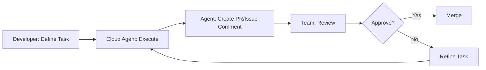

# Lesson 8: Parallel Agents & Cloud Agents

**Session Duration:** 20 minutes  
**Audience:** Embedded/C++ Developers (Intermediate to Advanced)  
**Environment:** Windows, VS Code  
**Extensions:** GitHub Copilot  
**Source Control:** GitHub/Bitbucket

---

## Overview

This lesson teaches you to multiply your productivity by running multiple Copilot agents simultaneously. You'll learn to coordinate parallel workflows, leverage cloud/background agents for asynchronous tasks, and orchestrate complex multi-domain features using the 6-agent + 9-skill architecture.

### What You'll Learn

- **Parallel Agent Patterns** - Run multiple agent instances with different task contexts
- **Cloud/Background Agents** - Offload work to GitHub infrastructure for async processing
- **Coordination Strategies** - Plan, launch, review, and integrate parallel outputs
- **Multi-Domain Development** - Tackle hardware, firmware, control, and testing simultaneously

### Key Concepts

| Concept | Description |
|---------|-------------|
| **Parallel Agents** | Multiple chat windows running different agents with specialized task contexts |
| **6 Orchestrator Agents** | **ODrive Engineer**, **ODrive QA**, **ODrive Ops**, **ODrive Reviewer**, **ODrive Toolchain**, **Ada to C++ Migrator** |
| **9 Specialized Skills** | Agents invoke skills: `control-algorithms`, `cpp-testing`, `foc-tuning`, `odrive-ops`, `odrive-toolchain`, `pcb-review`, `sensorless-control`, `signal-integrity`, `ada-cpp-migration` |
| **Cloud Agents** | Asynchronous agents that work in background on GitHub infrastructure |
| **Coordination Phases** | Design → Review → Implement → Integrate workflow |
| **Skill Routing** | Agents automatically invoke appropriate skills based on task context |

---

## Table of Contents

- [Overview](#overview)
- [Prerequisites](#prerequisites)
- [Why Parallel Agents Matter](#why-parallel-agents-matter)
- [Learning Path](#learning-path)
- [Running Multiple Agents](#1-running-multiple-agents-8-min)
- [Cloud/Background Agents](#2-cloudbackground-agents-7-min)
- [Guided Demo: Multi-Agent Workflow](#3-guided-demo-multi-agent-workflow-5-min)
- [Practice Exercises](#practice-exercises)
- [Quick Reference](#quick-reference-parallel-agent-patterns)
- [Troubleshooting](#troubleshooting)
- [Additional Resources](#additional-resources)
- [Frequently Asked Questions](#frequently-asked-questions)
- [Summary: Key Takeaways](#summary-key-takeaways)

---

## Prerequisites

Before starting this session, ensure you have:

- **Completed Agentic Development & Context Engineering** - Understanding of agent selection and context layering
- **Visual Studio Code** with GitHub Copilot extensions installed and enabled
- **Active Copilot subscription** with access to all features
- **Custom agents configured** - Verify `.github/agents/` folder contains agent definitions
- **Multiple chat panels** - Ability to open several Copilot Chat windows

### Verify Your Setup

1. **Test multiple chat windows:**
   - Open Chat view (Ctrl+Alt+I)
   - Right-click on Chat tab → Move to New Window (or split)
   - Verify you can have 2+ independent chat sessions

2. **Verify agent availability:**
   - In each chat window, click the **agent dropdown** (top of chat panel)
   - Confirm all 6 custom agents appear in the list:
     - **ODrive Engineer** (primary development orchestrator)
     - **ODrive QA** (testing & quality assurance)
     - **ODrive Ops** (CI/CD & release operations)
     - **ODrive Reviewer** (code review specialist)
     - **ODrive Toolchain** (build & test operations)
     - **Ada to C++ Migrator** (Ada to C++ migration specialist)

3. **Test agent selection in parallel:**
   - Window 1: Select **ODrive Engineer** from dropdown
   - Window 2: Select **ODrive QA** from dropdown
   - Send a test message in each simultaneously

> **Important:** Custom agents are selected from the **dropdown menu** at the top of the chat panel, NOT via @mention syntax. The @mention syntax (like `@workspace`) is only for built-in Copilot features.

---

## Why Parallel Agents Matter

Parallel agent workflows represent a significant productivity multiplier for complex development tasks.

### Benefits of Parallel Agents

1. **Accelerated Development**
   - Multiple tasks execute simultaneously
   - Reduce wait time from 4x to 1x
   - Get comprehensive feedback in minutes, not hours

2. **Domain Expertise Convergence**
   - Each agent contributes specialized knowledge
   - Hardware, firmware, control, and QA perspectives
   - Better architecture decisions from multiple viewpoints

3. **Reduced Context Switching**
   - Launch all tasks, then review all outputs
   - Focus on integration, not task management
   - Maintain mental flow state

4. **Scalable Complexity**
   - Handle larger features without overwhelm
   - Break complex problems into parallel tracks
   - Coordinate via interfaces, not serial dependencies

---

## Learning Path

This lesson covers three main topics in sequence:

| Topic | Focus | Time |
|-------|-------|------|
| Running Multiple Agents | Patterns, coordination, launching | 8 min |
| Cloud/Background Agents | Async workflows, GitHub integration | 7 min |
| Guided Demo: Multi-Agent Workflow | Encoder calibration with parallel agents | 5 min |

---

## 1. Running Multiple Agents (8 min)

### What Are Parallel Agents?
**🎯 Copilot Modes: Agent (Multiple Instances)**

**Files to demonstrate:**
- [src-ODrive/.github/agents/ODrive-Engineer.agent.md](../../src-ODrive/.github/agents/ODrive-Engineer.agent.md) - Primary development orchestrator
- [src-ODrive/.github/agents/ODrive-QA.agent.md](../../src-ODrive/.github/agents/ODrive-QA.agent.md) - Testing & quality assurance
- [src-ODrive/.github/agents/ODrive-Ops.agent.md](../../src-ODrive/.github/agents/ODrive-Ops.agent.md) - CI/CD & release operations
- [src-ODrive/.github/agents/ODrive-Reviewer.agent.md](../../src-ODrive/.github/agents/ODrive-Reviewer.agent.md) - Code review specialist
- [src-ODrive/.github/agents/ODrive-Toolchain.agent.md](../../src-ODrive/.github/agents/ODrive-Toolchain.agent.md) - Build & test operations
- [src-ODrive/.github/agents/ada-to-cpp-migrator.agent.md](../../src-ODrive/.github/agents/ada-to-cpp-migrator.agent.md) - Ada to C++ migration
- [src-ODrive/.github/skills/](../../src-ODrive/.github/skills/) - 9 specialized skills invoked by agents

> **Architecture Note:** The ODrive system uses **6 specialized agents** that can each invoke from **9 skills**. For parallel workflows, run different agents in parallel (select from dropdown in each chat window) or multiple instances of the same agent with different task contexts.
>
> **How to invoke:** Select the agent from the **dropdown menu** at the top of each Copilot Chat panel, then type your prompt.

### Sequential vs Parallel Comparison

| Sequential Development | Parallel Agent Development |
|------------------------|---------------------------|
| Task 1: Design API → wait | Task 1: ODrive Engineer design API (firmware focus) |
| Task 2: Implement firmware → wait | Task 2: ODrive Toolchain build & validate |
| Task 3: Write tests → wait | Task 3: ODrive QA plan tests and validation |
| Task 4: Code review → wait | Task 4: ODrive Reviewer check code quality |
| **Total: 4 × wait time** | **Total: 1 × wait time** |

> **Key Insight:** You can run different agents in parallel (**ODrive Engineer**, **ODrive QA**, **ODrive Toolchain**, **ODrive Reviewer**), or run multiple instances of the same agent with different task contexts.

---

### When to Use Parallel Agents

| ✅ Good Use Cases | ❌ Poor Use Cases |
|-------------------|-------------------|
| Independent tasks - Different agents on separate modules | Dependent tasks - Task B needs output from Task A |
| Cross-domain features - HW + FW + SW components | Same file edits - Potential merge conflicts |
| Multi-file refactoring - Different subsystems | Simple tasks - Overhead not worth it |
| Research & implementation - One researches, one implements | Sequential workflows - Clear ordering required |

---

### Parallel Agent Patterns
**🎯 Copilot Mode: Agent**

#### Pattern 1: Domain Separation

**Scenario:** Add new motor control feature

**🤖 Agent Mode Prompts (Parallel):**

| Window | Agent | Task Focus |
|--------|-------|------------|
| 1 | **ODrive Engineer** | Design the control algorithm (control-algorithms skill) |
| 2 | **ODrive Engineer** | Design embedded implementation (firmware focus) |
| 3 | **ODrive Engineer** | Validate electrical constraints (pcb-review skill) |
| 4 | **ODrive QA** | Create test plan and fixtures (cpp-testing skill) |

> **Note:** The same agent can be used in multiple windows with different task contexts. The agent will invoke the appropriate skill based on your request.

#### Pattern 2: Multi-Module Feature

**Scenario:** Implement over-the-air (OTA) firmware updates

**🤖 Agent Mode Prompts (Parallel):**
```
Window 1 - ODrive Engineer (Bootloader):
  "Design bootloader protocol for secure firmware updates"

Window 2 - ODrive Engineer (Application):
  "Add firmware update state machine to axis.cpp"

Window 3 - Regular Copilot (Python Tools):
  "Create upload utility in tools/firmware_update.py"

Window 4 - ODrive QA (Testing):
  "Design test strategy and test rig configuration"
```

#### Pattern 3: Refactoring Campaign

**Scenario:** Modernize legacy code across codebase

**🤖 Agent Mode Prompts (Parallel):**
```
Window 1: "Refactor Firmware/MotorControl/motor.cpp to modern C++17"
Window 2: "Improve error handling in Firmware/communication/can/odrive_can.cpp"
Window 3: "Add type hints to tools/odrive/*.py"
Window 4: "Regenerate API docs and update examples"
```

---

### How to Launch Parallel Agents

#### Option 1: Multiple Chat Windows (VS Code)
- Open multiple Copilot Chat panels
- Assign each to a different task
- Use `@agent-name` to target specific agents

#### Option 2: GitHub Copilot Workspace (Web-based)
- Use GitHub.com Copilot chat
- Can run cloud agents in background
- Results delivered to PR or issue

#### Option 3: CLI with Background Jobs (Advanced)
```powershell
# Launch multiple agents via CLI (future capability)
gh copilot agent @firmware-engineer "task 1" --background
gh copilot agent @qa-engineer "task 2" --background
gh copilot agent list-jobs
```

---

### Coordinating Parallel Agents
**🎯 Copilot Mode: Agent**

**Challenge:** Agents work independently - how do you coordinate?

**Solution: Master Coordination Plan**

| Phase | Activities | Duration |
|-------|-----------|----------|
| **Phase 1: Parallel Design** | Launch all agents with their tasks | 5 min |
| **Phase 2: Review & Align** | Review outputs, identify integration points | 5 min |
| **Phase 3: Parallel Implementation** | Agents implement based on aligned design | 10 min |
| **Phase 4: Integration** | Combine work, test end-to-end | 5 min |

**💬 Chat Mode Prompt (Coordination Example):**
```
Phase 1 - Launch in parallel:

Agent A: ODrive Engineer (Control Focus)
  "Design optimized Park transform using SIMD instructions"

Agent B: ODrive Engineer (Firmware Focus)
  "Research STM32 DSP library for fast trigonometry"

Agent C: ODrive QA (Testing Focus)
  "Create performance benchmarking harness"
```

---

## 2. Cloud/Background Agents (7 min)

### What Are Cloud Agents?
**🎯 Copilot Mode: Background/Cloud**

| Local Agents (What we've used) | Cloud/Background Agents |
|-------------------------------|------------------------|
| Run in VS Code | Run on GitHub infrastructure |
| You wait for response | Work asynchronously |
| Interactive chat session | Deliver results when done (PR, issue, notification) |

---

### Use Cases for Background Agents
**🎯 Copilot Mode: Background**

#### Use Case 1: Code Review Automation

**Example GitHub Actions Workflow:**
```yaml
# .github/workflows/copilot-review.yml
on:
  pull_request:
    types: [opened, synchronize]

jobs:
  review:
    runs-on: ubuntu-latest
    steps:
      - uses: actions/checkout@v4
      - name: Run Copilot Review
        run: |
          gh copilot agent ODrive QA \
            "Review this PR for:
             - MISRA C++ compliance
             - Interrupt safety
             - Memory leaks
             - Test coverage"
```

**Result:** Agent invokes `cpp-testing` skill to analyze the PR

#### Use Case 2: Continuous Refactoring

Run background agents to gradually improve codebase:
```
Background Task 1: "Add Doxygen comments to all public APIs"
Background Task 2: "Convert raw pointers to smart pointers"
Background Task 3: "Add unit tests for uncovered functions"
```
Agents work overnight, create draft PRs for review

#### Use Case 3: Documentation Generation

**🤖 Agent Mode Prompt (Background):**
```
Background Task: ODrive Engineer
  "Generate API reference documentation for all classes 
   in Firmware/MotorControl/*.hpp and create markdown 
   files in docs/api/"
```
Agent processes all files, generates docs, opens PR

#### Use Case 4: Multi-Repository Updates

For organizations with multiple repos:
```
Background Task: "Update all repositories to use new 
  CAN protocol version. Repos: ODrive-Firmware, 
  ODrive-Tools, ODrive-GUI"
```
Agent creates coordinated PRs across repos

---

### Benefits vs Limitations

| ✅ Benefits | ⚠️ Limitations |
|------------|----------------|
| Asynchronous work - Don't block development | Requires GitHub.com - Not VS Code alone |
| Large-scale tasks - Entire codebases | Less interactive - Can't iterate real-time |
| Scheduled execution - Run during off-hours | Review required - Always review agent PRs |
| Audit trail - All changes tracked in PRs | Rate limits - Subject to GitHub API limits |
| Team collaboration - Results visible to all | Context size - Limited by model window |

---

### Background Agent Workflow



---

### Demo: Background Agent via GitHub.com
**🎯 Copilot Mode: Cloud**

**Live Demo Steps:**

1. Navigate to GitHub.com repository
2. Open an issue: "Add temperature monitoring to motor.cpp"
3. In issue comments, tag agent:

**🤖 Agent Mode Prompt (GitHub Issue):**
```
@copilot ODrive Engineer 
Please implement temperature monitoring with NTC thermistor 
support in Firmware/MotorControl/motor.cpp

Requirements:
- Use Steinhart-Hart equation
- Add thermal shutdown at 85°C
- Configurable via axis.config_
- Update diagnostics struct
```

4. Agent processes in background
5. Agent responds with implementation plan or code
6. Can iterate in issue comments
7. Agent can open PR with implementation

**Note:** As of early 2025, this feature is in beta. Check GitHub Copilot docs for latest capabilities.

---

## 3. Guided Demo: Multi-Agent Workflow (5 min)

### Example: Implement Encoder Calibration Feature
**🎯 Copilot Modes: Agent (Multiple Parallel Instances)**

**Scenario:** Implement automatic encoder calibration

This feature requires:
- **Hardware knowledge** - Encoder electrical specs
- **Firmware implementation** - Calibration routine
- **Control theory** - How calibration affects control
- **Testing** - Validation strategy

> **Approach:** Use multiple instances of **ODrive Engineer** with different task focuses, plus **ODrive QA** for testing. The agents will invoke appropriate skills based on the task context.

**Files to work with:**
- [src-ODrive/Firmware/MotorControl/encoder.hpp](../../src-ODrive/Firmware/MotorControl/encoder.hpp) - Encoder class definition
- [src-ODrive/Firmware/MotorControl/encoder.cpp](../../src-ODrive/Firmware/MotorControl/encoder.cpp) - Encoder implementation
- [src-ODrive/Firmware/MotorControl/axis.hpp](../../src-ODrive/Firmware/MotorControl/axis.hpp) - State machine patterns

---

### Step-by-Step Guide

#### Step 1: Define the Feature (30 sec)

> "We need to add automatic encoder calibration. This is complex because it touches hardware, firmware, control algorithms, and testing. Let's use parallel agents."

#### Step 2: Launch Parallel Agents (2 min)

**Open 4 separate Chat windows** (or tabs)

**🤖 Agent Mode Prompt - Window 1 (Hardware Focus):**

> Select **ODrive Engineer** from agent dropdown, then paste:

```
What are the electrical requirements for 
encoder calibration on ODrive v3.6?

- Encoder type: Incremental with index
- Calibration involves rotating motor one full revolution
- Need to measure electrical angle vs mechanical angle
- Any constraints on rotation speed or current?

(This task will use the pcb-review skill internally)
```

**🤖 Agent Mode Prompt - Window 2 (Firmware Focus):**

> Select **ODrive Engineer** from agent dropdown, then paste:

```
Design the calibration routine for encoder.cpp

Requirements:
- Rotate motor at constant velocity (e.g., 1 rev/sec)
- Record encoder counts vs electrical angle
- Detect index pulse
- Store calibration table in NVM
- Must be interrupt-safe
- Allow user to trigger via axis.requested_state

Show me the function signature and high-level algorithm.
```

**🤖 Agent Mode Prompt - Window 3 (Control Focus):**

> Select **ODrive Engineer** from agent dropdown, then paste:

```
What's the optimal motor control 
strategy during encoder calibration?

- Need smooth, constant velocity
- Minimize torque ripple
- Open loop or closed loop?
- What if there's load on the motor?

(This task will use control-algorithms skill internally)
```

**🤖 Agent Mode Prompt - Window 4 (Testing):**

> Select **ODrive QA** from agent dropdown, then paste:

```
Create a test plan for encoder calibration feature.

What to test:
- Calibration accuracy
- Repeatability (run 10 times, compare results)
- Behavior with load on motor
- Error cases (stall, overvoltage, etc.)
- Calibration data persistence (survives reboot)

(This invokes the cpp-testing skill)
```

#### Step 3: Review Outputs (1.5 min)

Review each agent's output:
- **ODrive-Engineer (Hardware)** → Voltage/current limits and encoder specs
- **ODrive-Engineer (Firmware)** → Calibration algorithm structure
- **ODrive-Engineer (Control)** → Open-loop constant current recommendation
- **ODrive-QA (Testing)** → Comprehensive test cases

**Key Insight:** Each window's output informs the others, even though they use the same agents with different task contexts!

#### Step 4: Integration (1 min)

**🤖 Agent Mode Prompt - Integration Window:**

> Select **ODrive Engineer** from agent dropdown, then paste:

```
Now implement the full calibration routine.

Context from parallel windows:
- Hardware: Max calibration current 10A, speed < 2 rev/sec
- Control: Use open-loop with constant Iq current
- Testing: Need to log calibration data for validation

Files: 
#file:src-ODrive/Firmware/MotorControl/encoder.cpp
#file:src-ODrive/Firmware/MotorControl/encoder.hpp

Implement calibrate() method following the design from earlier.

Acceptance Criteria:
- Static allocation only
- Interrupt-safe operations
- Error codes, no exceptions
- Doxygen documentation
```

> The agent will synthesize outputs from all windows into a cohesive implementation.

---

### Success Criteria

By the end of this exercise, you should have:
- ✅ **4 windows** worked simultaneously on different aspects
- ✅ **Each window** contributed domain-specific expertise via the same agents with different contexts
- ✅ **Total time** ~3-4 minutes vs. 15-20 minutes sequential
- ✅ **Better quality** - Each domain properly addressed through skill invocation

### Key Takeaways

1. **Parallel = faster** - Multiple perspectives simultaneously
2. **Task context matters** - Same agent can handle different domains based on prompt
3. **Skills are invoked automatically** - Agents route to appropriate skills
4. **Integration phase** - You synthesize the outputs
5. **Coordination matters** - Pre-define interfaces when possible

---

## Practice Exercises

These exercises help you master parallel agent workflows. Complete them to build confidence with multi-agent coordination.

### Exercise 1: Parallel Agent Setup

**Objective:** Configure your environment for parallel agent workflows

**Steps:**

1. **Open Copilot Chat** (Ctrl+Alt+I)
2. **Create multiple windows:**
   - Right-click on the Chat tab → "Move to New Window" or drag to split
   - Repeat until you have 4 chat windows/panels
3. **Configure each window for a different task focus:**
   - Window 1: **ODrive Engineer** (firmware focus)
   - Window 2: **ODrive Engineer** (control focus)
   - Window 3: **ODrive Engineer** (hardware focus)
   - Window 4: **ODrive QA** (testing focus)

**Verification Checklist:**
- [ ] 4 chat windows open and visible
- [ ] Each window has the appropriate agent selected from dropdown
- [ ] You can send messages independently in each window

<details>
<summary><strong>Solution & Tips</strong></summary>

**Window Layout Options:**
- **Split horizontally:** View → Editor Layout → Split Down (Ctrl+K Ctrl+\\)
- **Split vertically:** View → Editor Layout → Split Right (Ctrl+\\)
- **Floating windows:** Drag tab outside VS Code to create new window
- **Grid layout:** Combine splits for 2x2 grid

**Verification Test:**
Send a simple message to each window simultaneously:
```
Window 1: "ODrive Engineer What files define the motor controller?"
Window 2: "ODrive Engineer What control modes does ODrive support?"
Window 3: "ODrive Engineer What voltage ratings does ODrive v3.6 support?"
Window 4: "ODrive QA What testing frameworks are used in ODrive?"
```

All four should respond independently without blocking each other.

**Pro Tip:** Save this layout with View → Editor Layout → Save Layout for quick access.

</details>

---

### Exercise 2: Parallel Feature Design - CAN Heartbeat

**Objective:** Use parallel agents to design a multi-domain feature

**Feature:** Add CAN bus heartbeat monitoring to detect communication failures

**Steps:**

1. **Launch these prompts in parallel** (one per window):

| Window | Agent | Prompt |
|--------|-------|--------|
| 1 | ODrive Engineer | "Design heartbeat packet structure for CAN bus on ODrive" |
| 2 | ODrive Engineer | "What are CAN bus timing constraints for heartbeat monitoring?" |
| 3 | ODrive Engineer | "How should heartbeat failure affect motor state machine?" |
| 4 | ODrive QA | "Create test cases for CAN heartbeat monitoring feature" |

2. **Review each output** and note key information
3. **Identify integration points** between the outputs

**Review Checklist:**
- [ ] All 4 windows responded with domain-specific information
- [ ] Outputs address different aspects without contradiction
- [ ] You can identify how outputs connect together

<details>
<summary><strong>Solution: Expected Outputs</strong></summary>

**Window 1 (Packet Structure) - Expected Response:**
```
Heartbeat Packet Design:
- CAN ID: 0x700 + node_id (NMT heartbeat standard)
- Payload: 1 byte state + 2 byte error flags + timestamp
- Rate: 100ms default, configurable
- Boot message on startup

struct HeartbeatPacket {
    uint8_t state;      // BOOT, PREOP, OP, STOPPED
    uint16_t errors;    // Error flags bitfield
    uint32_t uptime_ms; // Optional: system uptime
};
```

**Window 2 (Timing Constraints) - Expected Response:**
```
CAN Timing Constraints:
- Bus load: Heartbeat at 10Hz = ~0.1% bus load at 1Mbps
- Timeout detection: 3x heartbeat period (300ms default)
- Jitter tolerance: ±10% acceptable
- Priority: Lower than real-time control messages
- Watchdog: Independent hardware timer recommended
```

**Window 3 (State Machine) - Expected Response:**
```
Heartbeat Failure Response:
1. Detect timeout (3 missed heartbeats)
2. Set axis.error = ERROR_HEARTBEAT_TIMEOUT
3. Transition to IDLE state (configurable)
4. Options:
   - COAST: Free-spinning (safest)
   - BRAKE: Active braking then coast
   - HOLD: Maintain position (risky without commands)
5. Require explicit clear before restart
```

**Window 4 (Test Cases) - Expected Response:**
```
Test Plan:
1. Normal operation: Verify heartbeat sent at configured rate
2. Timeout detection: Stop heartbeat, verify timeout after 3x period
3. Recovery: Resume heartbeat, verify system recovers
4. Bus-off: Test behavior during CAN bus errors
5. Configuration: Verify period changes take effect
6. Multi-node: Test with multiple devices on bus
7. Boot sequence: Verify boot message sent on startup
```

**Integration Points:**
- Packet structure defines what QA tests validate
- Timing constraints inform test timing parameters
- State machine behavior must match test expectations

</details>

---

### Exercise 3: Integration Practice

**Objective:** Synthesize parallel outputs into a cohesive implementation request

**Steps:**

1. **Review outputs** from Exercise 2 (or use the solution examples)
2. **Create an integration prompt** that combines all domain knowledge:

> Select **ODrive Engineer** from agent dropdown, then paste:

```
Implement CAN heartbeat monitoring.

Context from parallel analysis:
- Packet: 0x700+node_id, 1 byte state + 2 byte errors, 100ms default
- Timing: 3x period timeout, ±10% jitter tolerance, lower priority than control
- State: On timeout set ERROR_HEARTBEAT_TIMEOUT, transition to IDLE (configurable)
- Tests: Need boot message, timeout detection, recovery, multi-node support

Files:
#file:src-ODrive/Firmware/communication/can/odrive_can.cpp
#file:src-ODrive/Firmware/MotorControl/axis.hpp

Requirements:
- Static allocation only
- Interrupt-safe timeout check
- Configurable via axis.config_
- Error codes, no exceptions

Implement the heartbeat sender and timeout detector.
```

3. **Send the integration prompt** and review the synthesized implementation

<details>
<summary><strong>Solution: What to Look For</strong></summary>

**Good Integration Output Should Include:**

1. **Configuration structure:**
```cpp
struct HeartbeatConfig {
    bool enable = true;
    uint32_t period_ms = 100;
    uint32_t timeout_ms = 300;  // 3x period
    AxisState timeout_action = AXIS_STATE_IDLE;
};
```

2. **Heartbeat sender (called from main loop):**
```cpp
void send_heartbeat() {
    if (!config_.heartbeat.enable) return;
    if (timer_ms_ - last_heartbeat_ms_ < config_.heartbeat.period_ms) return;
    
    HeartbeatPacket pkt = {
        .state = static_cast<uint8_t>(current_state_),
        .errors = static_cast<uint16_t>(error_)
    };
    can_send(0x700 + node_id_, &pkt, sizeof(pkt));
    last_heartbeat_ms_ = timer_ms_;
}
```

3. **Timeout detector:**
```cpp
void check_heartbeat_timeout() {
    if (!config_.heartbeat.enable) return;
    if (timer_ms_ - last_received_heartbeat_ms_ > config_.heartbeat.timeout_ms) {
        error_ |= ERROR_HEARTBEAT_TIMEOUT;
        requested_state_ = config_.heartbeat.timeout_action;
    }
}
```

**Key Validation:**
- Static allocation ✅ (no `new` or `malloc`)
- Interrupt-safe ✅ (simple comparisons, no blocking)
- Configurable ✅ (via config struct)
- Error codes ✅ (no exceptions)

</details>

---

### Exercise 4: Cloud Agent Workflow Simulation

**Objective:** Understand how to structure requests for background/cloud agents

**Scenario:** You want to set up automated code review on PRs using cloud agents

**Steps:**

1. **Create a GitHub Actions workflow** that would trigger Copilot review:

```yaml
# .github/workflows/copilot-review.yml
name: Copilot Code Review

on:
  pull_request:
    types: [opened, synchronize]
    paths:
      - 'Firmware/**/*.cpp'
      - 'Firmware/**/*.hpp'

jobs:
  review:
    runs-on: ubuntu-latest
    steps:
      - uses: actions/checkout@v4
      - name: Run Copilot Review
        run: |
          gh copilot agent ODrive QA \
            "Review this PR for:
             - MISRA C++ compliance
             - Interrupt safety issues
             - Memory leaks or unbounded allocations
             - Missing error handling
             - Test coverage gaps"
```

2. **Think about:** What makes this effective for async review?

<details>
<summary><strong>Solution: Cloud Agent Best Practices</strong></summary>

**Why This Workflow Works:**

1. **Scoped trigger:** Only runs on firmware changes (`.cpp`, `.hpp` files)
2. **Clear agent selection:** **ODrive QA** is the right agent for code review
3. **Specific criteria:** Bullet list tells agent exactly what to check
4. **Async-friendly:** Results appear as PR comments, not blocking

**Improvements to Consider:**

```yaml
# Enhanced version
- name: Run Copilot Review
  run: |
    gh copilot agent ODrive QA \
      "Review this PR for embedded firmware best practices.
       
       Check for:
       - MISRA C++ 2023 compliance (focus on rules 0-1, 5-x, 6-x)
       - ISR safety: no blocking calls, volatile for shared data
       - Memory: static allocation only, no heap usage
       - Error handling: all error paths covered
       - Thread safety: proper mutex usage around shared resources
       
       For each issue found:
       1. Cite the specific file and line
       2. Explain why it's a problem
       3. Suggest a fix
       
       Provide a summary at the end with pass/fail status."
```

**Key Principles for Cloud Agents:**
- Be explicit about what "good" looks like
- Request structured output (file, line, suggestion)
- Ask for summary/verdict for quick triage
- Scope to specific domains (don't ask for everything)

</details>

---

### Exercise 5: Coordination Challenge

**Objective:** Practice the full parallel workflow with a complex feature

**Feature:** Add sensorless motor startup (no encoder, estimate position from back-EMF)

**Steps:**

1. **Plan your parallel tasks** (which windows, which agents, which focus areas)
2. **Launch 4 parallel prompts** targeting different domains
3. **Review and identify conflicts** or integration challenges
4. **Create integration prompt** that resolves conflicts
5. **Document what you learned** about coordination

<details>
<summary><strong>Solution: Recommended Approach</strong></summary>

**Parallel Task Plan:**

| Window | Agent | Focus | Prompt |
|--------|-------|-------|--------|
| 1 | ODrive Engineer | Control Theory | "Explain sensorless FOC startup: HFI vs I/F vs observer methods" |
| 2 | ODrive Engineer | Firmware | "What changes to motor.cpp for sensorless startup?" |
| 3 | ODrive Engineer | Tuning | "What parameters need tuning for sensorless operation?" |
| 4 | ODrive QA | Testing | "How to test sensorless startup without encoder?" |

**Expected Conflicts:**
- Control may recommend HFI, firmware may not support it yet
- Tuning parameters depend on method chosen
- Testing needs to know which method to validate

**Integration Strategy:**

> Select **ODrive Engineer** from agent dropdown, then paste:

```
Design sensorless startup for ODrive.

Parallel analysis summary:
- Control: Recommends I/F (inject current at angle) for simplicity
- Firmware: Can add state AXIS_STATE_SENSORLESS_STARTUP
- Tuning: Need ramp_current, ramp_time, transition_velocity
- Testing: Use known load, compare to encoder-based as reference

Decision: Use I/F method (simplest, most robust for initial implementation)

Files:
#file:src-ODrive/Firmware/MotorControl/motor.cpp
#file:src-ODrive/Firmware/MotorControl/axis.hpp

Implement sensorless startup state with I/F current injection.
```

**Coordination Lessons:**
1. **Pre-decide method** when options exist (don't let agents conflict)
2. **Integration prompt resolves** ambiguity by stating decisions
3. **Human is architect** - you make the final design calls
4. **Testing informs design** - QA constraints affect implementation

</details>

---

## Quick Reference: Parallel Agent Patterns

### Agent & Skill Assignment Guide

| Domain | Agent | Skill Invoked |
|--------|-------|---------------|
| Low-level firmware | **ODrive Engineer** | Direct implementation + odrive-toolchain for builds |
| Control algorithms | **ODrive Engineer** | control-algorithms (🚧), foc-tuning (🚧), sensorless-control (🚧) |
| Hardware specs | **ODrive Engineer** | pcb-review (🚧), signal-integrity (🚧) |
| Testing & QA | **ODrive QA** | cpp-testing |
| CI/CD & releases | **ODrive Ops** | odrive-ops |
| Code review | **ODrive Reviewer** | N/A (reads and reviews only) |
| Build & test | **ODrive Toolchain** | odrive-toolchain |
| Ada migration | **Ada to C++ Migrator** | ada-cpp-migration |

> **Legend:** 🚧 = Planned skill (not yet implemented)
>
> **Note:** Use different agents in parallel for their specialized domains, or run multiple instances of the same agent with different task contexts. Agents route to appropriate skills automatically.

### Parallel Workflow Checklist

```
Before launching:
├── [ ] Define feature scope
├── [ ] Identify domains involved
├── [ ] Assign agents to domains
└── [ ] Pre-define interfaces if possible

During execution:
├── [ ] Launch all agents simultaneously
├── [ ] Monitor for completion
└── [ ] Note any questions/conflicts

After completion:
├── [ ] Review each output individually
├── [ ] Identify integration points
├── [ ] Resolve conflicts
└── [ ] Create integration prompt
```

### Coordination Phases

| Phase | Duration | Activities |
|-------|----------|------------|
| Design | 5 min | Launch parallel agents with design tasks |
| Review | 5 min | Review outputs, identify integration points |
| Implementation | 10 min | Parallel implementation based on design |
| Integration | 5 min | Combine, test, refine |

### Common Pitfalls

| ❌ Don't | ✅ Do |
|----------|-------|
| Launch without a plan | Pre-define interfaces between agents |
| Assign overlapping tasks | Partition work clearly by domain |
| Blindly merge all outputs | Review, validate, integrate systematically |
| Use parallel for sequential tasks | Use parallel for independent tasks only |

---

## Troubleshooting

| Issue | Solution |
|-------|----------|
| Can't open multiple chat windows | Use View → Editor Layout → Split, or drag chat tab to new area |
| Agents giving conflicting advice | You're the architect - arbitrate or ask another agent to compare |
| One agent much slower than others | Continue with faster ones, integrate slow output later |
| Merge conflicts in generated code | Assign non-overlapping files/functions to each agent |
| Context not shared between windows | Each window is independent - copy relevant context to integration prompt |
| Too many agents to coordinate | Limit to 3-4 agents; beyond that, coordination overhead increases |
| Cloud agents not available | Feature may be in beta - check GitHub Copilot documentation |
| Background job not completing | Check GitHub Actions logs, verify API rate limits |

### Debug Tips

1. **Agent selection issues:**
   - Verify agent files exist in `src-ODrive/.github/agents/`
   - Check agents dropdown shows **ODrive Engineer** and **ODrive QA**
   - Ensure agent file has correct `.agent.md` extension

2. **Coordination problems:**
   - Start with 2 windows, then scale up
   - Use explicit interface definitions
   - Review sequentially before integrating
   - Same agent can handle multiple domains via different prompts

3. **Integration failures:**
   - Be explicit about context from each window
   - Include file references in integration prompt
   - Ask for merge strategy if conflicts exist

4. **Skills not invoked:**
   - Check `src-ODrive/.github/skills/` for available skills
   - Some skills are planned (🚧) and not yet implemented
   - Agent decides skill invocation based on task context

---

## Additional Resources

### Prompt Templates

See [demo-script.md](demo-script.md) for ready-to-use prompts

### Coordination Strategies

See [hands-on-exercise.md](hands-on-exercise.md) for more practice problems

### Official Documentation

- [GitHub Copilot Multi-Agent Workflows](https://docs.github.com/en/copilot/using-github-copilot/best-practices-for-using-github-copilot)
- [GitHub Actions with Copilot](https://docs.github.com/en/actions)
- [VS Code Multiple Editors](https://code.visualstudio.com/docs/getstarted/userinterface#_editor-groups)

---

## Frequently Asked Questions

### How do I avoid merge conflicts with parallel agents?

**Short Answer:** Assign non-overlapping files or functions to each agent window.

**Detailed Explanation:**
Parallel agents work independently and don't know what other windows are generating. If two agents modify the same file, you'll need to manually merge their outputs.

**Best Practices:**
1. **Different files:** Window 1 works on `encoder.cpp`, Window 2 on `motor.cpp`
2. **Different functions:** Window 1 implements `calibrate()`, Window 2 implements `validate()`
3. **Interface-first:** All windows agree on function signatures before implementing
4. **Review sequentially:** Even if launched in parallel, review outputs one at a time
5. **Integration window:** Use a final prompt to merge context from all windows

**Example Partition:**
```
Window 1: "Implement encoder calibration in encoder.cpp"
Window 2: "Implement calibration state machine in axis.cpp"
Window 3: "Implement calibration tests in test_encoder.cpp"
Window 4: "Document calibration in docs/calibration.md"
```
No overlapping files = no merge conflicts.

---

### What if agents give contradictory advice?

**Short Answer:** You're the architect - make the final call based on your requirements.

**Why This Happens:**
- Different prompts lead to different assumptions
- Agents optimize for their specific task context
- Some questions have multiple valid answers

**Resolution Strategies:**

1. **Arbitration Prompt:**
   ```
   ODrive Engineer I got two suggestions:
   - Option A: Use open-loop control for calibration
   - Option B: Use closed-loop with low gains
   
   Which is better for:
   - Motors with high cogging torque
   - Systems where encoder may have noise
   ```

2. **Requirements-Based Decision:**
   - If safety is critical: Choose the more conservative approach
   - If performance is critical: Choose the faster approach
   - If simplicity is critical: Choose the simpler implementation

3. **Ask for Trade-offs:**
   ```
   ODrive Engineer Compare these approaches for encoder calibration:
   1. Open-loop at constant current
   2. Closed-loop with observer
   
   What are the trade-offs in terms of accuracy, robustness, and complexity?
   ```

**Remember:** Conflicting advice often means there's no single "right" answer. Your domain knowledge decides.

---

### Can I use the same agent in multiple windows?

**Short Answer:** Yes! You can run the same agent with different task contexts, or use different specialized agents.

**How It Works:**
The ODrive system has **6 specialized agents** that invoke from **9 skills**:
- **ODrive Engineer** - Primary development orchestrator
- **ODrive QA** - Testing & quality assurance
- **ODrive Ops** - CI/CD & release operations
- **ODrive Reviewer** - Code review specialist
- **ODrive Toolchain** - Build & test operations
- **Ada to C++ Migrator** - Ada to C++ migration

You can run multiple instances of the same agent with different **task contexts**, or run different agents in parallel:

| Window | Agent | Task Context |
|--------|-------|--------------|
| 1 | ODrive Engineer | "Focus on firmware implementation..." |
| 2 | ODrive Engineer | "Focus on control algorithm design..." |
| 3 | ODrive Engineer | "Focus on hardware constraints..." |
| 4 | ODrive QA | "Focus on test strategy..." |

**Why This Works:**
- Each window maintains its own conversation context
- The agent adapts based on your prompt, not window identity
- Skills are invoked automatically based on task content
- No special configuration needed per window

---

### Can I use parallel agents in an air-gapped environment?

**Short Answer:** Local agents work with Foundry Local; cloud agents require internet.

| Environment | Local Agents (VS Code) | Cloud Agents (GitHub) |
|-------------|------------------------|----------------------|
| Internet connected | ✅ Full functionality | ✅ Full functionality |
| Air-gapped + Foundry Local | ✅ Works offline | ❌ Not available |
| Air-gapped, no local model | ❌ Requires connection | ❌ Not available |

**For Air-Gapped Development:**
1. Set up **Azure AI Foundry Local** on an approved internal server
2. Configure VS Code to use local endpoint
3. Custom agents work because they're just prompt files
4. Skills work if they don't require external services

**Limitations:**
- Model quality may differ from cloud
- No automatic updates
- May need IT approval for internal deployment

---

### How many windows can I run in parallel?

**Short Answer:** Technically unlimited; practically 3-4 is optimal.

**Scaling Analysis:**

| Windows | Coordination Overhead | Typical Use Case |
|---------|----------------------|------------------|
| 2 | Low - Easy to track | Quick dual-domain task |
| 3-4 | Medium - Manageable | Multi-domain feature |
| 5-6 | High - Getting complex | Large refactoring |
| 7+ | Very High - Diminishing returns | Probably too many |

**Why 3-4 is the Sweet Spot:**
- Most features touch 3-4 domains (firmware, control, testing, docs)
- Human working memory handles ~4 contexts well
- Review time scales linearly with window count
- Integration complexity scales quadratically

**When to Use More:**
- Large-scale refactoring across many subsystems
- Multi-repository updates
- You're very experienced with coordination

**Pro Tip:** Start with 2 windows. Add more only when you're comfortable.

---

### Do parallel agents cost more API credits?

**Short Answer:** Yes, but you save time, so cost-per-feature is often similar.

**Cost Analysis:**

| Metric | Sequential | Parallel (4 windows) |
|--------|------------|----------------------|
| API calls | 4 calls (one at a time) | 4 calls (simultaneous) |
| Total tokens | Similar | Similar |
| Wall-clock time | 4x wait | 1x wait |
| Your time | Higher (context switching) | Lower (batch review) |

**Why Cost is Similar:**
- You're asking the same questions either way
- Parallel just changes the timing, not the content
- Time saved has value too

**Cost Optimization Tips:**
1. Don't launch parallel for simple tasks
2. Be specific in prompts (fewer follow-ups needed)
3. Use integration prompts efficiently (combine context)
4. Cloud/background agents may have different pricing (check GitHub docs)

---

### When should I use cloud agents instead of local?

**Short Answer:** Use cloud for async, large-scale, or team-visible tasks.

**Decision Matrix:**

| Factor | Use Local Agents | Use Cloud Agents |
|--------|------------------|------------------|
| Iteration speed | ✅ Fast feedback loop | ❌ Async delay |
| Task size | Small to medium | Large (full codebase) |
| Team visibility | Just you | Results visible to team |
| Scheduling | During work hours | Overnight/scheduled |
| PR integration | Manual copy-paste | Automatic PR creation |
| Audit trail | Local chat history | GitHub issue/PR history |

**Ideal Cloud Agent Tasks:**
- Overnight documentation generation
- Scheduled code quality sweeps
- PR review automation
- Multi-repository updates

**Stick with Local When:**
- You need to iterate quickly
- Task requires back-and-forth refinement
- Working on experimental ideas
- Learning a new codebase

---

### How do I coordinate if agents can't see each other?

**Short Answer:** You're the coordination layer - use integration prompts.

**The Coordination Pattern:**

```
┌─────────────────────────────────────────────────┐
│                    YOU                          │
│            (Human Coordinator)                  │
├─────────────────────────────────────────────────┤
│  Review  │  Identify  │  Resolve  │  Integrate  │
│  outputs │  conflicts │  decisions│  via prompt │
└─────────────────────────────────────────────────┘
      ▲           ▲           ▲           ▲
      │           │           │           │
┌─────┴─────┬─────┴─────┬─────┴─────┬─────┴─────┐
│ Window 1  │ Window 2  │ Window 3  │ Window 4  │
│  Output   │  Output   │  Output   │  Output   │
└───────────┴───────────┴───────────┴───────────┘
```

**Integration Prompt Template:**

> Select **ODrive Engineer** from agent dropdown, then paste:

```
Implement [feature].

Context from parallel analysis:
- Firmware (Window 1): [key findings]
- Control (Window 2): [key findings]
- Hardware (Window 3): [key findings]
- Testing (Window 4): [key requirements]

Decisions made:
- [Conflict 1]: Chose approach A because [reason]
- [Conflict 2]: Chose approach B because [reason]

Requirements: [standard embedded constraints]

Files: #file:path/to/file.cpp

Implement the solution.
```

**Pro Tip:** Keep notes during review phase - you'll need them for integration.

---

## Summary: Key Takeaways

### Core Concepts

1. **Parallel = Faster**
   - Multiple perspectives generated simultaneously
   - 4 tasks in the time of 1
   - Total time reduced from 4x to 1x

2. **6 Specialized Agents, 9 Skills**
   - Use the right agent for the domain: **ODrive Engineer**, **ODrive QA**, **ODrive Ops**, **ODrive Reviewer**, **ODrive Toolchain**, **Ada to C++ Migrator**
   - Run different agents in parallel or same agent with different task contexts
   - Skills are invoked automatically based on prompt content

3. **You Are the Architect**
   - Agents provide domain expertise
   - You make integration decisions
   - Human review is always required

### Workflow Summary

```
Plan → Launch → Review → Integrate
  │       │        │         │
  │       │        │         └── Create synthesis prompt
  │       │        └── Identify conflicts, make decisions
  │       └── Send prompts simultaneously (4 windows)
  └── Define tasks, assign agents, partition files
```

### When to Use Parallel Agents

| ✅ Good Fit | ❌ Poor Fit |
|-------------|-------------|
| Multi-domain features | Simple single-file changes |
| Independent tasks | Sequential dependencies |
| Research + implementation | Same-file modifications |
| Complex refactoring | Trivial questions |

### Quick Reference

| Agent | Primary Use |
|-------|-------------|
| **ODrive Engineer** | Firmware, control, hardware (via different prompts) |
| **ODrive QA** | Testing, test generation, quality assurance |
| **ODrive Ops** | CI/CD workflows, releases, deployment |
| **ODrive Reviewer** | Code review, style, safety checks |
| **ODrive Toolchain** | Build firmware, run tests, symbol search |
| **Ada to C++ Migrator** | Ada to C++ migration specialist |

| Pattern | Description |
|---------|-------------|
| Domain Separation | Different prompts for firmware, control, hardware, testing |
| Multi-Module | Different files/subsystems in each window |
| Refactoring Campaign | Parallel improvements across codebase |

### Remember

- **Start small:** 2 windows, then scale up
- **Partition clearly:** Non-overlapping files/functions
- **Review before merging:** Don't blindly combine outputs
- **Coordination has cost:** 3-4 windows is usually optimal
- **Integration is key:** Your synthesis prompt ties everything together

---

*GitHub Copilot Parallel Agents & Cloud Agents Guide*  
*Last Updated: January 2026*
