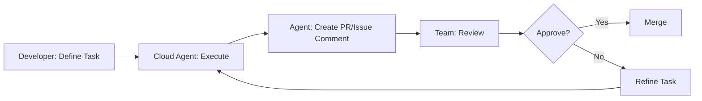

# Lesson 8: Parallel Agents & Cloud Agents

**Session Duration:** 20 minutes  
**Audience:** Embedded/C++ Developers (Intermediate to Advanced)  
**Environment:** Windows, VS Code  
**Extensions:** GitHub Copilot  
**Source Control:** GitHub/Bitbucket

---

## Table of Contents

- [Prerequisites](#prerequisites)
- [Why Parallel Agents Matter](#why-parallel-agents-matter)
- [Agenda](#agenda-parallel-agents--cloud-agents-20-min)
- [Running Multiple Agents](#1-running-multiple-agents-8-min)
- [Cloud/Background Agents](#2-cloudbackground-agents-7-min)
- [Hands-On: Multi-Agent Demo](#3-hands-on-multi-agent-demo-5-min)
- [Speaker Instructions](#speaker-instructions)
- [Participant Instructions](#participant-instructions)
- [Quick Reference](#quick-reference-parallel-agent-patterns)
- [Troubleshooting](#troubleshooting)
- [Additional Resources](#additional-resources)

---

## Prerequisites

Before starting this session, ensure you have:

- **Completed Agentic Development & Context Engineering** - Understanding of agent selection and context layering
- **Visual Studio Code** with GitHub Copilot extensions installed and enabled
- **Active Copilot subscription** with access to all features
- **Custom agents configured** - Verify `.github/agents/` folder contains agent definitions
- **Multiple chat panels** - Ability to open several Copilot Chat windows

### Verify Your Setup

1. **Test multiple chat windows:**
   - Open Chat view (Ctrl+Alt+I)
   - Right-click on Chat tab → Move to New Window (or split)
   - Verify you can have 2+ independent chat sessions

2. **Verify agent availability:**
   - In each chat window, confirm agents dropdown shows:
     - `@firmware-engineer`
     - `@motor-control-engineer`
     - `@hardware-engineer`
     - `@qa-engineer`

3. **Test agent selection in parallel:**
   - Window 1: Select `@firmware-engineer`
   - Window 2: Select `@qa-engineer`
   - Send a test message in each simultaneously

---

## Why Parallel Agents Matter

Parallel agent workflows represent a significant productivity multiplier for complex development tasks.

### Benefits of Parallel Agents

1. **Accelerated Development**
   - Multiple tasks execute simultaneously
   - Reduce wait time from 4x to 1x
   - Get comprehensive feedback in minutes, not hours

2. **Domain Expertise Convergence**
   - Each agent contributes specialized knowledge
   - Hardware, firmware, control, and QA perspectives
   - Better architecture decisions from multiple viewpoints

3. **Reduced Context Switching**
   - Launch all tasks, then review all outputs
   - Focus on integration, not task management
   - Maintain mental flow state

4. **Scalable Complexity**
   - Handle larger features without overwhelm
   - Break complex problems into parallel tracks
   - Coordinate via interfaces, not serial dependencies

---

## Agenda: Parallel Agents & Cloud Agents (20 min)

| Sub-Topic | Focus | Time |
|-----------|-------|------|
| Running Multiple Agents | Patterns, coordination, launching | 8 min |
| Cloud/Background Agents | Async workflows, GitHub integration | 7 min |
| **Hands-On:** Multi-Agent Demo | Encoder calibration with 4 agents | 5 min |

---

## 1. Running Multiple Agents (8 min)

### What Are Parallel Agents?
**🎯 Copilot Modes: Agent (Multiple Instances)**

**Files to demonstrate:**
- [.github/agents/firmware-engineer.agent.md](../../.github/agents/firmware-engineer.agent.md) - Firmware specialist
- [.github/agents/motor-control-engineer.agent.md](../../.github/agents/motor-control-engineer.agent.md) - Control theory specialist
- [.github/agents/qa-engineer.agent.md](../../.github/agents/qa-engineer.agent.md) - Testing specialist

### Sequential vs Parallel Comparison

| Sequential Development | Parallel Agent Development |
|------------------------|---------------------------|
| Task 1: Design API → wait | Task 1: @firmware-engineer design API |
| Task 2: Implement firmware → wait | Task 2: @motor-control-engineer design algorithm |
| Task 3: Write tests → wait | Task 3: @qa-engineer plan tests |
| Task 4: Update docs → wait | Task 4: Regular Copilot draft docs |
| **Total: 4 × wait time** | **Total: 1 × wait time** |

---

### When to Use Parallel Agents

| ✅ Good Use Cases | ❌ Poor Use Cases |
|-------------------|-------------------|
| Independent tasks - Different agents on separate modules | Dependent tasks - Task B needs output from Task A |
| Cross-domain features - HW + FW + SW components | Same file edits - Potential merge conflicts |
| Multi-file refactoring - Different subsystems | Simple tasks - Overhead not worth it |
| Research & implementation - One researches, one implements | Sequential workflows - Clear ordering required |

---

### Parallel Agent Patterns
**🎯 Copilot Mode: Agent**

#### Pattern 1: Domain Separation

**Scenario:** Add new motor control feature

**🤖 Agent Mode Prompts (Parallel):**

| Agent | Task | Focus |
|-------|------|-------|
| `@motor-control-engineer` | Design the control algorithm | Math/theory |
| `@firmware-engineer` | Design embedded implementation | Interrupts/DMA |
| `@hardware-engineer` | Validate electrical constraints | PWM frequency, current sensing |
| `@qa-engineer` | Create test plan and fixtures | Validation strategy |

#### Pattern 2: Multi-Module Feature

**Scenario:** Implement over-the-air (OTA) firmware updates

**🤖 Agent Mode Prompts (Parallel):**
```
Window 1 - @firmware-engineer (Bootloader):
  "Design bootloader protocol for secure firmware updates"

Window 2 - @firmware-engineer (Application):
  "Add firmware update state machine to axis.cpp"

Window 3 - Regular Copilot (Python Tools):
  "Create upload utility in tools/firmware_update.py"

Window 4 - @qa-engineer (Testing):
  "Design test strategy and test rig configuration"
```

#### Pattern 3: Refactoring Campaign

**Scenario:** Modernize legacy code across codebase

**🤖 Agent Mode Prompts (Parallel):**
```
Window 1: "Refactor Firmware/MotorControl/motor.cpp to modern C++17"
Window 2: "Improve error handling in Firmware/communication/can.cpp"
Window 3: "Add type hints to tools/odrive/*.py"
Window 4: "Regenerate API docs and update examples"
```

---

### How to Launch Parallel Agents

#### Option 1: Multiple Chat Windows (VS Code)
- Open multiple Copilot Chat panels
- Assign each to a different task
- Use `@agent-name` to target specific agents

#### Option 2: GitHub Copilot Workspace (Web-based)
- Use GitHub.com Copilot chat
- Can run cloud agents in background
- Results delivered to PR or issue

#### Option 3: CLI with Background Jobs (Advanced)
```powershell
# Launch multiple agents via CLI (future capability)
gh copilot agent @firmware-engineer "task 1" --background
gh copilot agent @qa-engineer "task 2" --background
gh copilot agent list-jobs
```

---

### Coordinating Parallel Agents
**🎯 Copilot Mode: Agent**

**Challenge:** Agents work independently - how do you coordinate?

**Solution: Master Coordination Plan**

| Phase | Activities | Duration |
|-------|-----------|----------|
| **Phase 1: Parallel Design** | Launch all agents with their tasks | 5 min |
| **Phase 2: Review & Align** | Review outputs, identify integration points | 5 min |
| **Phase 3: Parallel Implementation** | Agents implement based on aligned design | 10 min |
| **Phase 4: Integration** | Combine work, test end-to-end | 5 min |

**💬 Chat Mode Prompt (Coordination Example):**
```
Phase 1 - Launch in parallel:

Agent A: @motor-control-engineer
  "Design optimized Park transform using SIMD instructions"

Agent B: @firmware-engineer
  "Research STM32 DSP library for fast trigonometry"

Agent C: @qa-engineer
  "Create performance benchmarking harness"
```

---

## 2. Cloud/Background Agents (7 min)

### What Are Cloud Agents?
**🎯 Copilot Mode: Background/Cloud**

| Local Agents (What we've used) | Cloud/Background Agents |
|-------------------------------|------------------------|
| Run in VS Code | Run on GitHub infrastructure |
| You wait for response | Work asynchronously |
| Interactive chat session | Deliver results when done (PR, issue, notification) |

---

### Use Cases for Background Agents
**🎯 Copilot Mode: Background**

#### Use Case 1: Code Review Automation

**Example GitHub Actions Workflow:**
```yaml
# .github/workflows/copilot-review.yml
on:
  pull_request:
    types: [opened, synchronize]

jobs:
  review:
    runs-on: ubuntu-latest
    steps:
      - uses: actions/checkout@v4
      - name: Run Copilot Review
        run: |
          gh copilot agent @qa-engineer \
            "Review this PR for:
             - MISRA C++ compliance
             - Interrupt safety
             - Memory leaks
             - Test coverage"
```

**Result:** Agent comments on PR with findings

#### Use Case 2: Continuous Refactoring

Run background agents to gradually improve codebase:
```
Background Task 1: "Add Doxygen comments to all public APIs"
Background Task 2: "Convert raw pointers to smart pointers"
Background Task 3: "Add unit tests for uncovered functions"
```
Agents work overnight, create draft PRs for review

#### Use Case 3: Documentation Generation

**🤖 Agent Mode Prompt (Background):**
```
Background Task: @firmware-engineer
  "Generate API reference documentation for all classes 
   in Firmware/MotorControl/*.hpp and create markdown 
   files in docs/api/"
```
Agent processes all files, generates docs, opens PR

#### Use Case 4: Multi-Repository Updates

For organizations with multiple repos:
```
Background Task: "Update all repositories to use new 
  CAN protocol version. Repos: ODrive-Firmware, 
  ODrive-Tools, ODrive-GUI"
```
Agent creates coordinated PRs across repos

---

### Benefits vs Limitations

| ✅ Benefits | ⚠️ Limitations |
|------------|----------------|
| Asynchronous work - Don't block development | Requires GitHub.com - Not VS Code alone |
| Large-scale tasks - Entire codebases | Less interactive - Can't iterate real-time |
| Scheduled execution - Run during off-hours | Review required - Always review agent PRs |
| Audit trail - All changes tracked in PRs | Rate limits - Subject to GitHub API limits |
| Team collaboration - Results visible to all | Context size - Limited by model window |

---

### Background Agent Workflow



---

### Demo: Background Agent via GitHub.com
**🎯 Copilot Mode: Cloud**

**Live Demo Steps:**

1. Navigate to GitHub.com repository
2. Open an issue: "Add temperature monitoring to motor.cpp"
3. In issue comments, tag agent:

**🤖 Agent Mode Prompt (GitHub Issue):**
```
@copilot @firmware-engineer 
Please implement temperature monitoring with NTC thermistor 
support in Firmware/MotorControl/motor.cpp

Requirements:
- Use Steinhart-Hart equation
- Add thermal shutdown at 85°C
- Configurable via axis.config_
- Update diagnostics struct
```

4. Agent processes in background
5. Agent responds with implementation plan or code
6. Can iterate in issue comments
7. Agent can open PR with implementation

**Note:** As of early 2025, this feature is in beta. Check GitHub Copilot docs for latest capabilities.

---

## 3. Hands-On: Multi-Agent Demo (5 min)

### Exercise: Implement Encoder Calibration Feature
**🎯 Copilot Modes: Agent (4 Parallel Instances)**

**Scenario:** Implement automatic encoder calibration

This feature requires:
- **Hardware knowledge** - Encoder electrical specs
- **Firmware implementation** - Calibration routine
- **Control theory** - How calibration affects control
- **Testing** - Validation strategy

**Files to work with:**
- [src-ODrive/Firmware/MotorControl/encoder.hpp](../../src-ODrive/Firmware/MotorControl/encoder.hpp) - Encoder class definition
- [src-ODrive/Firmware/MotorControl/encoder.cpp](../../src-ODrive/Firmware/MotorControl/encoder.cpp) - Encoder implementation
- [src-ODrive/Firmware/MotorControl/axis.hpp](../../src-ODrive/Firmware/MotorControl/axis.hpp) - State machine patterns

---

### Step-by-Step Guide

#### Step 1: Define the Feature (30 sec)

> "We need to add automatic encoder calibration. This is complex because it touches hardware, firmware, control algorithms, and testing. Let's use parallel agents."

#### Step 2: Launch Parallel Agents (2 min)

**Open 4 separate Chat windows** (or tabs)

**🤖 Agent Mode Prompt - Window 1 (Hardware):**
```
@hardware-engineer What are the electrical requirements for 
encoder calibration on ODrive v3.6?

- Encoder type: Incremental with index
- Calibration involves rotating motor one full revolution
- Need to measure electrical angle vs mechanical angle
- Any constraints on rotation speed or current?
```

**🤖 Agent Mode Prompt - Window 2 (Firmware):**
```
@firmware-engineer Design the calibration routine for encoder.cpp

Requirements:
- Rotate motor at constant velocity (e.g., 1 rev/sec)
- Record encoder counts vs electrical angle
- Detect index pulse
- Store calibration table in NVM
- Must be interrupt-safe
- Allow user to trigger via axis.requested_state

Show me the function signature and high-level algorithm.
```

**🤖 Agent Mode Prompt - Window 3 (Control):**
```
@motor-control-engineer What's the optimal motor control 
strategy during encoder calibration?

- Need smooth, constant velocity
- Minimize torque ripple
- Open loop or closed loop?
- What if there's load on the motor?
```

**🤖 Agent Mode Prompt - Window 4 (Testing):**
```
@qa-engineer Create a test plan for encoder calibration feature.

What to test:
- Calibration accuracy
- Repeatability (run 10 times, compare results)
- Behavior with load on motor
- Error cases (stall, overvoltage, etc.)
- Calibration data persistence (survives reboot)
```

#### Step 3: Review Outputs (1.5 min)

Review each agent's output:
- **Hardware Engineer** → Voltage/current limits and encoder specs
- **Firmware Engineer** → Calibration algorithm structure
- **Motor Control Engineer** → Open-loop constant current recommendation
- **QA Engineer** → Comprehensive test cases

**Key Insight:** Each agent's output informs the others!

#### Step 4: Integration (1 min)

**🤖 Agent Mode Prompt - Integration Window:**
```
@firmware-engineer Now implement the full calibration routine.

Context from parallel agents:
- Hardware: Max calibration current 10A, speed < 2 rev/sec
- Control: Use open-loop with constant Iq current
- Testing: Need to log calibration data for validation

Files: 
#file:src-ODrive/Firmware/MotorControl/encoder.cpp
#file:src-ODrive/Firmware/MotorControl/encoder.hpp

Implement calibrate() method following the design from earlier.

Acceptance Criteria:
- Static allocation only
- Interrupt-safe operations
- Error codes, no exceptions
- Doxygen documentation
```

---

### Success Criteria

By the end of this exercise, you should have:
- ✅ **4 agents** worked simultaneously on different aspects
- ✅ **Each agent** contributed domain-specific expertise
- ✅ **Total time** ~3-4 minutes vs. 15-20 minutes sequential
- ✅ **Better quality** - Each domain properly addressed

### Key Takeaways

1. **Parallel = faster** - Multiple perspectives simultaneously
2. **Domain separation** - Right agent for each aspect
3. **Integration phase** - You synthesize the outputs
4. **Coordination matters** - Pre-define interfaces when possible

---

## Speaker Instructions

### 1. Demo: Running Multiple Agents (8 min)

**Setup before demo:**
1. Open 4 chat windows/panels in VS Code
2. Pre-select different agents in each window
3. Have encoder.cpp and motor.cpp open in editor

**Show sequential vs parallel:**
1. Explain the time savings visually
2. Show the comparison table on screen
3. Emphasize: "Same quality, fraction of the time"

**Demo parallel patterns:**
1. Walk through Pattern 1: Domain Separation
2. Show how to assign agents to windows
3. Launch all 4 prompts "simultaneously"
4. Highlight independent execution

**Coordination demonstration:**
1. Show coordination phases diagram
2. Explain interface agreement
3. Demonstrate review process
4. Show integration prompt

### 2. Demo: Cloud/Background Agents (7 min)

**Explain the concept:**
1. Local vs Cloud comparison table
2. Use cases for async work
3. Benefits for team workflows

**Show GitHub Actions integration:**
1. Display the YAML workflow example
2. Explain trigger on PR
3. Show how agent comments on PR

**Live demo (if available):**
1. Navigate to GitHub.com
2. Open an issue
3. Tag @copilot in comment
4. Show async response (or explain if in beta)

**Key points:**
- Not blocking your development
- Results visible to team
- Always requires human review

### 3. Demo: Hands-On Multi-Agent Demo (5 min)

**Guide participants:**
1. Have everyone open 4 chat windows
2. Walk through each agent prompt together
3. Launch all simultaneously
4. Give 1-2 minutes for responses
5. Review outputs as a group
6. Show integration step

**Wrap-up:**
- Summarize time savings
- Emphasize coordination importance
- Preview Day 2 applications

---

## Participant Instructions

### Exercise 1: Parallel Agent Setup (2 min)

**Task:** Configure your environment for parallel agents

1. Open Copilot Chat (Ctrl+Alt+I)
2. Right-click tab → "Move to New Window" or split panel
3. Repeat until you have 4 chat windows
4. In each window, select a different agent:
   - Window 1: `@firmware-engineer`
   - Window 2: `@motor-control-engineer`
   - Window 3: `@hardware-engineer`
   - Window 4: `@qa-engineer`

**Verification:**
- [ ] 4 chat windows open
- [ ] Each has a different agent selected
- [ ] Can send messages independently

### Exercise 2: Parallel Feature Design (3 min)

**Task:** Use parallel agents to design a new feature

**Feature:** Add CAN bus heartbeat monitoring

Launch these prompts in parallel:

| Window | Agent | Prompt |
|--------|-------|--------|
| 1 | @firmware-engineer | "Design heartbeat packet structure for CAN bus" |
| 2 | @hardware-engineer | "What are CAN bus timing constraints for heartbeat?" |
| 3 | @motor-control-engineer | "How should heartbeat failure affect motor state?" |
| 4 | @qa-engineer | "Create test cases for heartbeat monitoring" |

**Review checklist:**
- [ ] All 4 agents responded
- [ ] Outputs are domain-specific
- [ ] Can identify integration points

### Exercise 3: Integration Practice (2 min)

**Task:** Synthesize parallel outputs into implementation

After reviewing all 4 agent outputs, create an integration prompt:

**🤖 Integration Prompt Template:**
```
@firmware-engineer Implement CAN heartbeat monitoring.

Context from parallel agents:
- Hardware: [timing constraints from @hardware-engineer]
- Control: [state machine changes from @motor-control-engineer]
- Testing: [key test cases from @qa-engineer]

Requirements:
- Static allocation only
- Interrupt-safe
- Follow ODrive patterns

Implement in communication/can.cpp
```

---

## Quick Reference: Parallel Agent Patterns

### Agent Assignment Guide

| Domain | Agent | Typical Tasks |
|--------|-------|---------------|
| Low-level firmware | `@firmware-engineer` | Drivers, interrupts, DMA, memory |
| Control algorithms | `@motor-control-engineer` | PID, FOC, observers, filters |
| Hardware specs | `@hardware-engineer` | Pinouts, electrical, timing |
| Testing | `@qa-engineer` | Test plans, coverage, validation |

### Parallel Workflow Checklist

```
Before launching:
├── [ ] Define feature scope
├── [ ] Identify domains involved
├── [ ] Assign agents to domains
└── [ ] Pre-define interfaces if possible

During execution:
├── [ ] Launch all agents simultaneously
├── [ ] Monitor for completion
└── [ ] Note any questions/conflicts

After completion:
├── [ ] Review each output individually
├── [ ] Identify integration points
├── [ ] Resolve conflicts
└── [ ] Create integration prompt
```

### Coordination Phases

| Phase | Duration | Activities |
|-------|----------|------------|
| Design | 5 min | Launch parallel agents with design tasks |
| Review | 5 min | Review outputs, identify integration points |
| Implementation | 10 min | Parallel implementation based on design |
| Integration | 5 min | Combine, test, refine |

### Common Pitfalls

| ❌ Don't | ✅ Do |
|----------|-------|
| Launch without a plan | Pre-define interfaces between agents |
| Assign overlapping tasks | Partition work clearly by domain |
| Blindly merge all outputs | Review, validate, integrate systematically |
| Use parallel for sequential tasks | Use parallel for independent tasks only |

---

## Troubleshooting

| Issue | Solution |
|-------|----------|
| Can't open multiple chat windows | Use View → Editor Layout → Split, or drag chat tab to new area |
| Agents giving conflicting advice | You're the architect - arbitrate or ask another agent to compare |
| One agent much slower than others | Continue with faster ones, integrate slow output later |
| Merge conflicts in generated code | Assign non-overlapping files/functions to each agent |
| Context not shared between windows | Each window is independent - copy relevant context to integration prompt |
| Too many agents to coordinate | Limit to 3-4 agents; beyond that, coordination overhead increases |
| Cloud agents not available | Feature may be in beta - check GitHub Copilot documentation |
| Background job not completing | Check GitHub Actions logs, verify API rate limits |

### Debug Tips

1. **Agent selection issues:**
   - Verify agent file exists in `.github/agents/`
   - Check agents dropdown in each window
   - Ensure agent file has correct `.agent.md` extension

2. **Coordination problems:**
   - Start with 2 agents, then scale up
   - Use explicit interface definitions
   - Review sequentially before integrating

3. **Integration failures:**
   - Be explicit about context from each agent
   - Include file references in integration prompt
   - Ask for merge strategy if conflicts exist

---

## Additional Resources

### Prompt Templates

See [demo-script.md](demo-script.md) for ready-to-use prompts

### Coordination Strategies

See [hands-on-exercise.md](hands-on-exercise.md) for more practice problems

### Official Documentation

- [GitHub Copilot Multi-Agent Workflows](https://docs.github.com/en/copilot/using-github-copilot/best-practices-for-using-github-copilot)
- [GitHub Actions with Copilot](https://docs.github.com/en/actions)
- [VS Code Multiple Editors](https://code.visualstudio.com/docs/getstarted/userinterface#_editor-groups)

---

## Q&A Topics

Be prepared to answer:

**"How do I avoid merge conflicts with parallel agents?"**
- Keep agents working on different files when possible
- If same file, assign non-overlapping sections
- Review and integrate sequentially

**"What if agents give contradictory advice?"**
- You're the architect - make the final call
- Use another agent to arbitrate: "@motor-control-engineer which approach is better?"
- This is why human review is essential

**"Can I use parallel agents in an air-gapped environment?"**
- Local agents (VS Code): Yes, if you have Foundry Local
- Cloud agents: No, requires internet connectivity

**"How many agents can I run in parallel?"**
- Technically: As many as you want
- Practically: 3-4 is manageable
- Beyond that, coordination overhead increases

**"Do parallel agents cost more API credits?"**
- Yes, each agent counts as separate API usage
- But you save time, so cost per feature is similar
- Background agents may have different pricing (check GitHub)

---

*GitHub Copilot Parallel Agents & Cloud Agents Guide*  
*Last Updated: January 2026*
